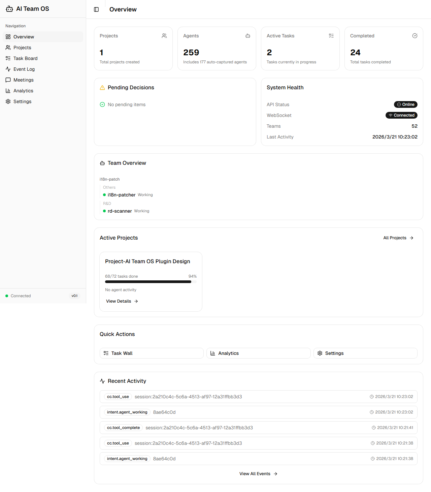
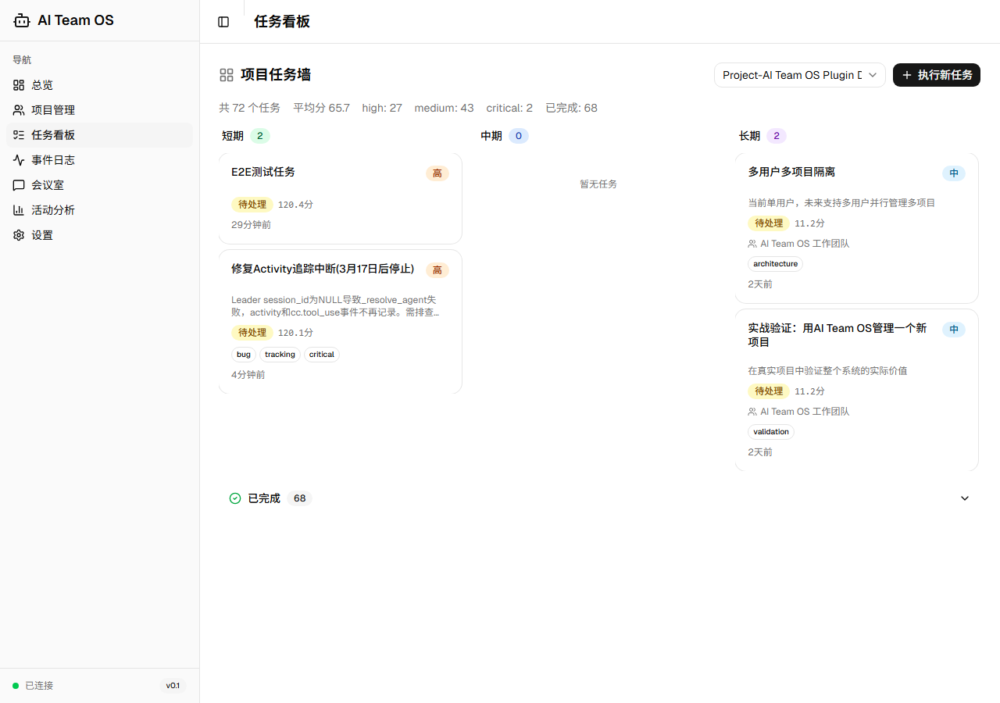
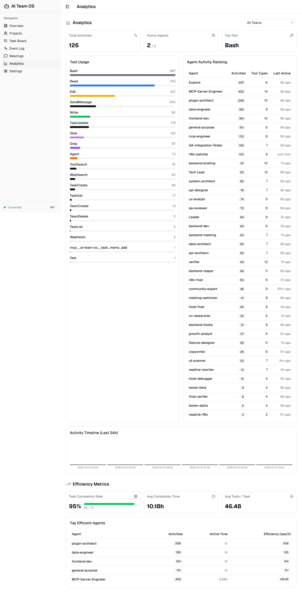

[English](README.md) | [中文](README.zh-CN.md)

# AI Team OS

<!-- Logo placeholder -->
<!--  -->

**The Operating System for AI Agent Teams**

[](https://python.org)
[](LICENSE)
[](https://fastapi.tiangolo.com)
[](https://react.dev)
[](https://modelcontextprotocol.io)
[](https://github.com/CronusL-1141/AI-company)

---

> **Claude Code is built for solo developers. AI Team OS gives it the power of an entire organization.**

---

AI Team OS is an **OS enhancement layer** built on top of Claude Code. Through MCP Protocol + Hook System + Agent Templates, it transforms a single Claude Code instance into a self-managing AI team that operates like a real company — with division of labor, persistent memory, structured meetings, and continuous self-improvement from every failure.

**What you get in 30 seconds:**
- An AI team with defined roles, shared memory, structured meetings, and self-correcting behavior
- Automatic root cause analysis on every failure — similar tasks get early warnings next time
- A visual command center — track what every Agent is doing and why, in real time

---

## Why AI Team OS?

### The Problem

| Current Reality | The Pain Point |
|----------------|----------------|
| Claude Code runs as a single instance | Cannot parallelize complex multi-role tasks |
| Failures are forgotten immediately | Same mistakes repeat — no learning loop |
| Decision-making is a black box | You can't tell why an Agent made a choice |
| Task assignment is manual | No intelligent matching based on capability data |
| No meeting collaboration mechanism | Multi-Agent discussions lack structured process |

### The Solution

AI Team OS adds an **OS enhancement layer** on top of Claude Code, transforming team operations across four dimensions:

```
Explainable  — Every decision is traceable; supports timeline replay and intent inspection
Learnable    — The system extracts patterns from failures and continuously improves
Adaptive     — The task wall responds to events in real time, auto-matching the best Agent
Manageable   — Dashboard shows live team status; intervene or pause with one click
```

### How It Compares

| Dimension | AI Team OS | CrewAI | AutoGen | LangGraph | Devin |
|-----------|-----------|--------|---------|-----------|-------|
| **Category** | CC Enhancement OS | Standalone Framework | Standalone Framework | Workflow Engine | Standalone AI Engineer |
| **Integration** | MCP Protocol into CC | Independent Python | Independent Python | Independent Python | SaaS Product |
| **Meeting System** | 7 structured templates | None | Limited | None | None |
| **Failure Learning** | Failure Alchemy (Antibody/Vaccine/Catalyst) | None | None | None | Limited |
| **Decision Transparency** | Decision Cockpit + Timeline | None | Limited | Limited | Black box |
| **Rule System** | 4-layer defense (48+ rules) | Limited | Limited | None | Limited |
| **Agent Templates** | 22 ready-to-use | Built-in roles | Built-in roles | None | None |
| **Dashboard** | React 19 visualization | Commercial tier | None | None | Yes |
| **Open Source** | MIT | Apache 2.0 | MIT | MIT | No |
| **Claude Code Native** | ✅ Deep integration | ❌ | ❌ | ❌ | ❌ |

---

## Core Features

### 🏢 Team Orchestration
- **22 professional Agent templates** covering Engineering, Testing, Research, and Management — ready out of the box
- **Department grouping** with support for multi-department structures (Engineering / QA / Research)
- **Intelligent Agent matching** — automatically recommends the best Agent based on task characteristics

### 📋 Task Management
- **Event-driven Task Wall 2.0** — real-time task state updates via push, no polling required
- **Loop Engine** — automatically advances task lifecycles with AWARE loop + deadlock detection
- **What-If Analyzer** — multi-option comparison with path simulation and recommendations

### 🤝 Meeting System
- **7 structured meeting templates**: Brainstorming / Decision / Tech Review / Retrospective / Status Sync / Expert Consultation / Conflict Resolution
- Built on proven methodologies: Six Thinking Hats, DACI Framework, Design Sprint
- Every meeting must produce actionable conclusions — "we discussed but didn't decide" is not allowed

### 🛡️ Quality Assurance
- **Failure Alchemy**: Every failure automatically triggers root cause extraction → classification → improvement suggestions, building a continuous learning loop
  - Antibody: Failure experiences stored in memory to prevent repeat mistakes
  - Vaccine: High-frequency failure patterns converted into pre-task warnings
  - Catalyst: Failure analysis injected into Agent system prompts to improve future execution
- **4-layer defense rule system**: Awareness (CLAUDE.md) → Guidance (SessionStart) → Enforcement (PreToolUse) → Contract (MCP validation)
- **Safety guardrails** with 14 core safety rules blocking dangerous operations

### 📊 Dashboard Command Center
- **Decision Cockpit**: Event stream + decision timeline + intent inspection — every decision has a traceable record
- **Activity Tracking**: Real-time display of each Agent's status and current task
- **Department Panorama**: Full team overview on a single screen

### 🧠 Living Team Memory
- **Knowledge sharing**: Agent work products accumulate into team knowledge, searchable across tasks
- **Experience inheritance**: Failures and success patterns stored systematically, referenced automatically on new tasks
- **AWARE Loop**: A complete memory cycle — Perceive → Record → Distill → Apply

### 🔧 40+ MCP Tools
Plug in via MCP Protocol with no additional configuration — natively integrated with Claude Code.

### 📐 Rule Injection System
- **30+ B-Rules** (behavioral standards) + **18 A-Rules** (architectural constraints)
- Leader autonomy rules baked into the OS, reducing the need for manual intervention

---

## Architecture

```
┌─────────────────────────────────────────────────────────────────┐
│                     User (Chairman)                              │
│                         │                                       │
│                         ▼                                       │
│                   Leader (CEO)                                   │
│            ┌────────────┼────────────┐                          │
│            ▼            ▼            ▼                          │
│       Agent Templates  Task Wall  Meeting System                 │
│      (22 roles)       Loop Engine  (7 templates)                 │
│            │            │            │                          │
│            └────────────┼────────────┘                          │
│                         ▼                                       │
│              ┌──────────────────────┐                           │
│              │   OS Enhancement Layer│                           │
│              │  ┌──────────────┐    │                           │
│              │  │  MCP Server  │    │                           │
│              │  │  (40+ tools) │    │                           │
│              │  └──────┬───────┘    │                           │
│              │         │            │                           │
│              │  ┌──────▼───────┐    │                           │
│              │  │  FastAPI     │    │                           │
│              │  │  REST API    │    │                           │
│              │  └──────┬───────┘    │                           │
│              │         │            │                           │
│              │  ┌──────▼───────┐    │                           │
│              │  │  Dashboard   │    │                           │
│              │  │ (React 19)   │    │                           │
│              │  └──────────────┘    │                           │
│              └──────────────────────┘                           │
│                         │                                       │
│              ┌──────────▼──────────┐                            │
│              │  Storage (SQLite)   │                            │
│              │  + Memory System    │                            │
│              └─────────────────────┘                            │
└─────────────────────────────────────────────────────────────────┘
```

### Five-Layer Technical Architecture

```
Layer 5: Web Dashboard    — React 19 + TypeScript + Shadcn UI
Layer 4: CLI + REST API   — Typer + FastAPI
Layer 3: Team Orchestrator — LangGraph StateGraph
Layer 2: Memory Manager   — Mem0 / File fallback
Layer 1: Storage          — SQLite (development) / PostgreSQL (production)
```

### Hook System (The Bridge Between CC and OS)

```
SessionStart     → session_bootstrap.py          — Inject Leader briefing + rule set + team state
SubagentStart    → inject_subagent_context.py    — Inject sub-Agent OS rules (2-Action etc.)
PreToolUse       → workflow_reminder.py          — Workflow reminders + safety guardrails
PostToolUse      → send_event.py                 — Forward events to OS API
UserPromptSubmit → context_monitor.py            — Monitor context usage rate
```

---

## Quick Start

### Prerequisites

- Python >= 3.11
- Claude Code (MCP support required)
- Node.js >= 20 (Dashboard frontend, optional)

### Three Steps to Launch

```bash
# Step 1: Clone the repository
git clone https://github.com/CronusL-1141/AI-company.git
cd AI-company/ai-team-os

# Step 2: Install (auto-configures MCP + Hooks)
python install.py

# Step 3: Restart Claude Code — the OS activates automatically
# Verify: run /mcp in CC and check that ai-team-os tools are mounted
```

### Verify Installation

```bash
# Check OS health
curl http://localhost:8000/health
# Expected: {"status": "ok", "version": "0.1.0"}

# Create your first team via CC
# Type in Claude Code:
# "Create a web development team with a frontend dev, backend dev, and QA engineer"
```

### Start the Dashboard

```bash
cd dashboard
npm install
npm run dev
# Visit http://localhost:5173
```

---

## Dashboard Screenshots

### Command Center


### Task Board


### Project Details & Decision Timeline


### Meeting Room


### Activity Analytics


### Event Log


---

## MCP Tools

<details>
<summary>Expand to see all 40+ MCP tools</summary>

### Team Management

| Tool | Description |
|------|-------------|
| `team_create` | Create an AI Agent team; supports coordinate/broadcast modes |
| `team_status` | Get team details and member status |
| `team_list` | List all teams |
| `team_briefing` | Get a full team panorama in one call (members + events + meetings + todos) |
| `team_setup_guide` | Recommend team role configuration based on project type |

### Agent Management

| Tool | Description |
|------|-------------|
| `agent_register` | Register a new Agent to a team |
| `agent_update_status` | Update Agent status (idle/busy/error) |
| `agent_list` | List team members |
| `agent_template_list` | Get available Agent template list |
| `agent_template_recommend` | Recommend the best Agent template based on task description |

### Task Management

| Tool | Description |
|------|-------------|
| `task_run` | Execute a task with full execution recording |
| `task_decompose` | Break a complex task into subtasks |
| `task_status` | Query task execution status |
| `taskwall_view` | View the task wall (all pending + in-progress + completed) |
| `task_create` | Create a new task |
| `task_auto_match` | Intelligently match the best Agent based on task characteristics |
| `task_memo_add` | Add an execution memo to a task |
| `task_memo_read` | Read task history memos |

### Loop Engine

| Tool | Description |
|------|-------------|
| `loop_start` | Start the auto-advance loop |
| `loop_status` | View loop status |
| `loop_next_task` | Get the next pending task |
| `loop_advance` | Advance the loop to the next stage |
| `loop_pause` | Pause the loop |
| `loop_resume` | Resume the loop |
| `loop_review` | Generate a loop review report (with failure analysis) |

### Meeting System

| Tool | Description |
|------|-------------|
| `meeting_create` | Create a structured meeting (supports 7 templates) |
| `meeting_send_message` | Send a meeting message |
| `meeting_read_messages` | Read meeting records |
| `meeting_conclude` | Summarize meeting conclusions |
| `meeting_template_list` | Get available meeting template list |

### Intelligence & Analysis

| Tool | Description |
|------|-------------|
| `failure_analysis` | Failure Alchemy — analyze root causes, generate antibody/vaccine/catalyst |
| `what_if_analysis` | What-If Analyzer — multi-option comparison and recommendation |
| `decision_log` | Log a decision to the cockpit timeline |
| `context_resolve` | Resolve current context and retrieve relevant background information |

### Memory System

| Tool | Description |
|------|-------------|
| `memory_search` | Full-text search of the team memory store |
| `team_knowledge` | Get a team knowledge summary |

### Project Management

| Tool | Description |
|------|-------------|
| `project_create` | Create a project |
| `phase_create` | Create a project phase |
| `phase_list` | List project phases |

### System Operations

| Tool | Description |
|------|-------------|
| `os_health_check` | OS health check |
| `event_list` | View the system event stream |
| `os_report_issue` | Report an issue |
| `os_resolve_issue` | Mark an issue as resolved |

</details>

---

## Agent Template Library

22 ready-to-use professional Agent templates covering a complete software engineering team:

### Engineering

| Template | Role | Use Case |
|----------|------|----------|
| `engineering-software-architect` | Software Architect | System design, architecture review |
| `engineering-backend-architect` | Backend Architect | API design, service architecture |
| `engineering-frontend-developer` | Frontend Developer | UI implementation, interaction development |
| `engineering-ai-engineer` | AI Engineer | Model integration, LLM applications |
| `engineering-mcp-builder` | MCP Builder | MCP tool development |
| `engineering-database-optimizer` | Database Optimizer | Query optimization, schema design |
| `engineering-devops-automator` | DevOps Automation Engineer | CI/CD, infrastructure |
| `engineering-sre` | Site Reliability Engineer | Observability, incident response |
| `engineering-security-engineer` | Security Engineer | Security review, vulnerability analysis |
| `engineering-rapid-prototyper` | Rapid Prototyper | MVP validation, fast iteration |
| `engineering-mobile-developer` | Mobile Developer | iOS/Android development |
| `engineering-git-workflow-master` | Git Workflow Master | Branch strategy, code collaboration |

### Testing

| Template | Role | Use Case |
|----------|------|----------|
| `testing-qa-engineer` | QA Engineer | Test strategy, quality assurance |
| `testing-api-tester` | API Test Specialist | Interface testing, contract testing |
| `testing-bug-fixer` | Bug Fix Specialist | Defect analysis, root cause investigation |
| `testing-performance-benchmarker` | Performance Benchmarker | Performance analysis, load testing |

### Research & Support

| Template | Role | Use Case |
|----------|------|----------|
| `specialized-workflow-architect` | Workflow Architect | Process design, automation orchestration |
| `support-technical-writer` | Technical Writer | API docs, user guides |
| `support-meeting-facilitator` | Meeting Facilitator | Structured discussion, decision facilitation |

### Management

| Template | Role | Use Case |
|----------|------|----------|
| `management-tech-lead` | Tech Lead | Technical decisions, team coordination |
| `management-project-manager` | Project Manager | Schedule management, risk tracking |

### Specialized Templates

| Template | Role | Use Case |
|----------|------|----------|
| `python-reviewer` | Python Code Reviewer | Python project code quality |
| `security-reviewer` | Security Reviewer | Code security scanning |
| `refactor-cleaner` | Refactor Cleaner | Technical debt cleanup |
| `tdd-guide` | TDD Guide | Test-driven development |

---

## Roadmap

### Completed ✅

- [x] Core Loop Engine (LoopEngine + Task Wall + Watchdog + Review)
- [x] Failure Alchemy (Antibody + Vaccine + Catalyst)
- [x] Decision Cockpit (Event stream + Timeline + Intent inspection)
- [x] Event-driven Task Wall 2.0 (Real-time push + Intelligent matching)
- [x] Living Team Memory (Knowledge query + Experience sharing)
- [x] What-If Analyzer (Multi-option comparison)
- [x] 7 structured meeting templates
- [x] 22 professional Agent templates
- [x] 4-layer defense rule system (30+ B-rules + 18 A-rules)
- [x] Dashboard Command Center (React 19)
- [x] 40+ MCP tools
- [x] AWARE loop memory system

### In Progress / Planned

- [ ] Multi-tenant isolation
- [ ] Production validation and performance optimization
- [ ] Claude Code Plugin Marketplace listing
- [ ] Full integration test suite
- [ ] Documentation site (Docusaurus)
- [ ] Video tutorial series

---

## Project Structure

```
ai-team-os/
├── src/aiteam/
│   ├── api/           — FastAPI REST endpoints
│   ├── mcp/           — MCP Server (40+ tools)
│   ├── loop/          — Loop Engine
│   ├── meeting/       — Meeting system
│   ├── memory/        — Team memory
│   ├── orchestrator/  — Team orchestrator
│   ├── storage/       — Storage layer (SQLite/PostgreSQL)
│   ├── templates/     — Agent template base classes
│   ├── hooks/         — CC Hook scripts
│   └── types.py       — Shared type definitions
├── dashboard/         — React 19 frontend
├── docs/              — Design documents (14 files)
├── tests/             — Test suite
├── install.py         — One-click install script
└── pyproject.toml
```

---

## Contributing

Contributions are welcome! We especially appreciate:

- **New Agent templates**: If you have prompt designs for specialized roles, PRs are welcome
- **Meeting template extensions**: New structured discussion patterns
- **Bug fixes**: Open an Issue or submit a PR directly
- **Documentation improvements**: Found a discrepancy between docs and code? Please correct it

```bash
# Set up development environment
git clone https://github.com/CronusL-1141/AI-company.git
cd AI-company/ai-team-os
pip install -e ".[dev]"
pytest tests/
```

Before submitting a PR, please ensure:
- `ruff check src/` passes
- `mypy src/` has no new errors
- Relevant tests pass

---

## License

MIT License — see [LICENSE](LICENSE)

---

<div align="center">

**AI Team OS** — Where AI teams operate like real organizations.

*Built with Claude Code · Powered by MCP Protocol*

[Docs](docs/) · [Issues](https://github.com/CronusL-1141/AI-company/issues) · [Discussions](https://github.com/CronusL-1141/AI-company/discussions)

</div>
