[English](README.md) | [中文](README.zh-CN.md)

# AI Team OS

<!-- Logo placeholder -->
<!--  -->

### Your AI coding tool stops when you stop prompting. Ours doesn't.

> ⚡ **v1.11.0** — Claude Code capability alignment: the OS now sees what CC had grown past it. Lifecycle events 11 → 15 (worktrees, background daemons, teammate idle, post-compaction), compaction checkpoints hand a Leader back its operating picture, plan bodies and human rulings are kept whole instead of truncated to 200 characters, and the CC session registry is bridged in as a second liveness track. Meanwhile pure heartbeats stopped writing events at all — about 40% fewer rows, with detection behaviour unchanged. Tool surface unchanged at 112.

[](https://python.org)
[](LICENSE)
[](https://fastapi.tiangolo.com)
[](https://react.dev)
[](https://modelcontextprotocol.io)
[](https://github.com/CronusL-1141/AI-company)

**112** MCP tools · **202** REST endpoints · **22** dashboard pages · **1,959** tests · **25** agent templates · **42** ecosystem research tools · **9** machine-checked invariants

---

AI Team OS turns Claude Code into a **self-driving AI company**.
You're the Chairman. AI is the CEO. Set the vision — the system executes, learns, and evolves autonomously.

---

## The Problem With Every Other AI Tool

Every AI coding assistant works the same way: you prompt, it responds, it stops. The moment you step away, work stops. You come back to a blank prompt.

AI Team OS works differently.

You walk away at night. The next morning you open your laptop and find:
- The CEO checked the task wall, picked up the next highest-priority item, and shipped it
- When it hit a blocker that needed your approval, it parked that thread and switched to a parallel workstream
- R&D agents scanned three competitor frameworks and found a technique worth adopting
- A brainstorming meeting was organized, 5 agents debated 4 proposals, and the best one was put on the task wall

You didn't prompt any of that. The system just ran.

---

## How It Works

**You're the Chairman. The AI Leader is the CEO.**

The CEO doesn't wait for instructions. It checks the task wall, picks the highest-priority item, assigns the right specialist Agent, and drives execution. When blocked, it switches workstreams. When all planned work is done, R&D agents activate — scanning for new technologies, organizing brainstorming meetings, and feeding improvements back into the system.

Every interaction makes the system understand you better. **Memory System v2** distills your preferences and corrections into a team direction layer that every dispatched Agent inherits at birth — you never say the same thing twice, and no next Agent repeats a pit an earlier one already fell into.

---

## Core Capabilities

### 1. Cross-Session Orchestration (new in v1.10.0)

A single CC session can now observe and drive its sibling sessions for one operational turn, instead of only being able to spawn brand-new ones:

- **Wake system v2**: the `/api/wake/actionable` single-source predicate feeds both the event watcher and the turn-end guard; SessionStart moves from a fixed 30-minute cron to dynamic `/loop` intervals; a Stop-hook turn-end guard always lets `decision:block` and user-stop keywords pass through; a session-scoped event watcher carries a 1-hour hard timeout. No resident daemons.
- **Fleet downlink primitive**: headless `claude -p --resume <session_id>` drives a target sibling session for one turn, reusing the existing wake machinery (semaphore, fuse, allowlist, per-session dedupe, full audit trail).
- **`agent_reuse_recommend` MCP tool**: a three-way reuse decision (reuse / slim-then-reuse / spawn-new) scored by domain match, reachability (live / resumable / cross-session / expired), and context watermark.
- **Context watermark ledger**: exact token usage read from the transcript tail (cheap-checks-first), surfaced as a three-color watermark bar on agent views and on the new fleet / worktree observability cards.
- **Compaction checkpoint** (v1.11.0): `PreCompact` freezes the OS-side operating picture — agents in flight, open tasks, decisions queued for you — and `SessionStart(source=compact)` hands it straight back. CC's own summary body is deliberately not stored: after compaction it is already in the model's context; what a compacted Leader loses is the OS-side state it no longer knows to ask about.
- **CC session registry as a second liveness track** (v1.11.0): `~/.claude/sessions/<pid>.json` carries a real pid and CC's own idle/busy state, which distinguishes "process gone" from "process alive but quiet" — a distinction transcript freshness cannot make. It runs alongside the existing verdict and only records where the two disagree; the verdict itself is unchanged until the divergence data says otherwise.
- **Background daemon sessions are visible** (v1.11.0): `GET /api/hooks/background-jobs` reads CC's own job state, so a `--bg` session that outlives its foreground window no longer looks like "nobody is working".

Usage guidance:
- A new session's SessionStart briefing already points you at running `/loop` once - follow it instead of guessing at intervals.
- Check the project detail page for the fleet card (per-session CEO / model / in-flight tasks / watermark) and the worktree card (branch ownership + unlanded-work status) before you act.
- Call `agent_reuse_recommend` before dispatching a follow-up agent - reusing a live or resumable sibling session beats spawning a fresh one.
- The S4 worktree teardown guard and per-template `isolation: worktree` defaults apply automatically; no configuration is needed.

### 2. Memory System v2 — two-layer memory, every Agent inherits at birth (new in v1.9.0)

The OS's signature differentiator: your team's preferences, corrections, and hard-won lessons flow automatically to every Agent it dispatches.

- **Direction layer** (user preferences / corrections / design intent, 4 kinds): resident injection via **both** the SessionStart and SubagentStart hooks — every sub-Agent inherits the team's values and red lines the moment it's born, so you don't repeat yourself. Size guardrails (<=40 entries x 400 chars), `supersedes` swap to prevent bloat, invalidate-never-delete for auditability.
- **Episodic layer** (`task_memos` ledger): task-level execution memos promoted to a dedicated table (row IDs / invalidation axis / quality score / scope_path), recalled on demand via pure-Python **BM25 Chinese retrieval**; 123 legacy memos backfilled with zero loss.
- **On-demand reconcile** (`memory_reconcile`): zero-LLM BM25 candidate clustering, then merge / invalidate / score / distill on agent confirmation — "the agent computes, the tool persists", with no background resident process introduced.

Surfaces: MCP `memory_add` / `memory_list` / `memory_invalidate` / `memory_search` / `memory_reconcile_candidates` / `memory_reconcile_apply`.

### 3. Progressive Tool-Loading Governance (new in v1.9.0)

Treats the resident context budget as the scarce resource it is — however many tools exist, they never drown your Agent.

- **alwaysLoad dynamic rotation**: at session start a single SQL recomputes the hot-tool whitelist by **7-day real call frequency** (>=2-day span gate against bursty spikes + 20% hysteresis, hard cap <=5), and CC skips ToolSearch for them. Not additive, not hand-tuned; any stats failure silently degrades to all-defer, and every whitelist is logged for audit.
- **`AITEAM_TOOLSETS` group switch**: 16 capability-domain toolsets; a startup env var decides which modules register. `default` core profile = task/team/memory/infra/reports (29 tools, hard cap <=50), with incremental `default,ecosystem` — fits non-CC clients that cap tool counts.
- **`AITEAM_READONLY` read-only profile**: an orthogonal overlay that strips every write tool by explicit allowlist and keeps only read tools — ideal for audit / observer sessions.
- **5 templates on least privilege**: meeting-facilitator / debate advocate & critic / technical-writer / project-manager carry `disallowedTools` structural denials; engineering / testing templates untouched.

### 4. Workflow / ultracode Persistent Observability (v1.7.0)

The OS does not intercept CC's built-in **ultracode/Workflow** — it becomes its persistent governance layer. Every Workflow run is automatically tracked into the OS, with no manual team setup:

- **Auto-tracking**: a hook turns each Workflow run into an OS "team" (`workflow-<wf_id>`) the moment it starts
- **Dashboard `/workflows`**: a live feed of run cards, a phase swimlane timeline, and per-agent telemetry — tokens / duration / status / tool-call counts, advancing live via incremental journal tailing while a run executes
- **Calibrated stall detection**: the stall threshold was calibrated on 3,378 real agent intervals (p99 = 77.6s, longest healthy silence 173.8s) and set at 5.2× the worst healthy case — it flags late rather than crying wolf
- **Project-detail integration**: workflow team rows carry an inline run summary (status / agent count / duration / finish time) plus a "view swimlane" deep link; members display semantic phase labels (e.g. `audit:sourceA`) instead of ids
- **Leader auto-detection**: a project's Leader session / model / liveness is probed directly from the `~/.claude/projects/` file truth by the backend — zero registration dependency, `/model` switches surface in real time
- **MCP tools**: `workflow_list` (browse runs), `workflow_get` (full archive + per-agent rows), `workflow_reconcile` (repair from on-disk snapshots after the OS was offline)
- **Self-healing ingestion**: hook receipt anchors + on-disk snapshot reconciliation + a reaper backstop close offline gaps automatically — finished runs on disk are ingested idempotently; cross-project attribution matches the on-disk path slug against registered projects

### 5. Ecosystem Research Platform — 42 tools

A project-isolated **knowledge base** that accumulates research findings over time. Each repo progresses through 4 stages (a progressive funnel, since v1.5.0), with token-efficient triggers and append-only history:

- **Stage 0 — Auto shallow-summary on archive**: newly-archived repos automatically get a 200-400 char `ai-engineer` summary (core function / positioning / advantages). 8-class failure handling with **self-learning hooks** (3+ same-class fails surface through `self_learning_pending`; the queue exposes recorder/searcher injection points you can wire to your own lesson store)
- **Stage 1 — On-demand architecture analysis**: user picks research direction ("memory_system") → batch-dispatch `backend-architect` agents to read architecture key files
- **Stage 2 — Multi-perspective debate**: triggers existing `debate_start` (NOT a built-in debate engine — **reuses meeting system**)
- **Stage 3 — Reference / Integrate marking**: `mark_as_reference` adds tag for future quick recall; `start_integration` triggers existing `task_create` for actual implementation
- **Active vs Full dual-view**: data is **append-only forever**. Stars-falling repos kept (just `is_active=False`); stars climbing back auto-promotes + re-queues Stage 0
- **Dashboard `/ecosystem`**: list with stage badges + research timeline + project filter dropdown + candidate-filter page (`/ecosystem/research`) + per-project settings tab — the single largest tool family in the OS

### 6. Knowledge Layer — Reference Graph + Unified Search (v1.8.0)

Everything the OS records — task memos, reports, tasks — becomes recallable knowledge:

- **Reference graph (P1a)**: a zero-LLM regex extractor mines OS-native ID references (wf_id / commit hash / task uuid / `[[memory]]`) out of memos and reports into an append-only `knowledge_links` table — the graph is a derived view, rebuildable from source text at any time
- **Unified search (P1b)**: `/api/search` fuses three arms via RRF — BM25 full-text (Chinese bigram native), knowledge-graph fanout (an ID query pulls in everything linked to it), and exact ID-prefix / title match
- **Global search box** in the Dashboard header, plus MCP tools `unified_search` / `link_query` / `link_trace` — recall past work by natural language ("how was the attribution fix done"), a `wf_` id, or a commit hash

> **Why zero-LLM?** The graph is a derived view: plain regexes extract the IDs, the whole graph can be rebuilt from source text at any time, and both extraction and retrieval cost zero tokens. Your recall pipeline never touches your model budget.

### 7. Task Wall · Meetings · 22-Page Dashboard

Governance ledger and panoramic visualization — everything leaves a trace:

- **Task wall**: a live board of pending / in-progress / done, event-driven + intelligent Agent matching + deadlock detection
- **8 structured meeting templates** (keyword auto-select, built on Six Thinking Hats / DACI / Design Sprint) — every meeting must produce an actionable conclusion; "we discussed but didn't decide" is not an outcome
- **22-page React 19 Dashboard**: Command Center / `/workflows` swimlane / decision timeline / meeting room / Ecosystem suite / Model Governance Settings

### 8. Autonomous Operation

The CEO never idles. It continuously advances work based on task wall priorities:

- Checks the task wall for the next highest-priority item when a task completes
- When blocked on something requiring your approval, parks that thread and switches to parallel workstreams
- Batches all strategic questions and reports them when you return — no interruptions for tactical decisions
- Deadlock detection: if the loop stalls, it surfaces the blocker rather than spinning

And it doesn't just execute — it evolves:

- **R&D cycle**: research agents scan competitors, new frameworks, and community tools; findings go to brainstorming meetings where agents challenge each other; conclusions become implementation plans on the task wall

### 9. File Truth as Source of Truth

Most multi-agent stacks trust agents to register themselves and self-report their status. AI Team OS treats self-reports as claims and files as facts — three subsystems already run on this philosophy:

- **Leader probing**: a project's Leader session, model, and liveness are read straight from `~/.claude/projects/` — transcript mtime is liveness, the model name in the transcript tail is the model. We don't ask an agent which model it runs — what's read out of the transcript is what's true.
- **Model discovery**: "available models" = every model that has actually appeared in your CC transcripts. Zero API dependency, zero hardcoded list — a hardcoded list will never contain your third-party gateway model; a transcript scan can't miss it.
- **Workflow telemetry**: on-disk run files are the full telemetry truth; the OS's projection tables are rebuildable caches of immutable files. Attribution iron law: a run belongs to a project only when its on-disk path slug exactly matches the registered project root — never guessed.

### 10. Model Governance (v1.8.1)

Know which models you can actually launch — and control what your sessions start on:

- **Auto-discovery of genuinely available models**: scans every CC transcript on your machine in about a second (60s cache) — including third-party gateway models that no hardcoded list would ever ship
- **One-click global default startup model**: written to `~/.claude/settings.json` under triple write protection — touches only the `model` key, keeps a `.bak-aiteam` backup, writes atomically, refuses corrupted files
- **Zero coercion**: soft reminders only, never a block — and CC Workflow runs are fully exempt

Surfaces: REST `/api/models/{available,default}` · MCP `model_config_get` / `model_config_set` · the Model Governance card in Dashboard Settings.

### 11. Team Collaboration

Not a single Agent. A structured organization:

- **25 professional Agent templates** (23 base + 2 debate roles) with recommendation engine — Engineering, Testing, Research, Management — ready out of the box
- **Department grouping** — Engineering / QA / Research with cross-team coordination
- **Channel communication**: `team:` / `project:` / `global` channels with `@mention` support
- **Debate mode**: 4-round structured debate (Advocate→Critic→Response→Judge) via `debate_start` / `debate_code_review`
- **Cross-agent lessons**: `failure_analysis` writes root-cause antibodies into project memory, and every dispatched sub-Agent inherits them through the direction layer

### 12. Full Transparency

Nothing is a black box:

- **Decision Cockpit**: event stream + decision timeline + intent inspection — every decision has a traceable record
- **Activity Tracking**: real-time status of every Agent and what it's working on
- **What-If Analyzer**: compare multiple approaches before committing, with path simulation and recommendations

### 13. Safety & Behavioral Enforcement

Built-in guardrails so the system can run unsupervised without surprises:

- **Guardrails L1**: 7 dangerous pattern detections + PII warnings + `InputGuardrailMiddleware`
- **Local agent blocking**: all non-readonly agents must declare `team_name`/`name` — prevents rogue background agents
- **S1 safety rules**: regex-based scan catches destructive commands (rm -rf, force push, hardcoded secrets) including uppercase flags and heredoc patterns
- **4-layer defense rule system**: 48+ rules covering workflow, delegation, session, and safety layers
- **Concurrent-edit warnings**: hooks flag a file two agents touched in quick succession, read straight from recent edit events (the cooperative file-lock tools were retired in v1.10.3 — the lock file was empty in every real run)
- **Agent Watchdog**: on-demand `POST /api/teams/{id}/watchdog/check` plus the background patrol — flags BUSY-timeout agents, long-pending tasks and unblockable dependencies
- **Self-patrol**: watchdog lease patrol + reaper reconciliation backstop + identity verification before any kill — the OS keeps eyes on itself, not just on your agents
- **Completion verification**: `verify_completion` checks task status + memo existence — prevents hallucinated "done" reports
- **Ecosystem integration recipes**: 4 preset recipes (GitHub / Slack / Linear / Full-stack team) under `find_skill(level=2, category="integration")`
- **`find_skill` 3-layer progressive discovery**: quick recommend → category browse → full detail, reducing tool-call overhead

### 14. Zero Extra Cost

Runs entirely within your existing Claude Code subscription:

- No external API calls, no extra token spend
- MCP tools, hooks, and Agent templates are all local
- The memory system and knowledge layer are zero-LLM by design — direction-layer injection, graph extraction, search, and reconcile coarse-pass all cost zero tokens
- 100% utilization of your CC plan

### More Capabilities (legacy & secondary — still running, queryable on demand)

- **Failure Alchemy**: `failure_analysis` still runs as part of the loop subsystem — every failed task extracts root cause and produces *Antibody* (stored in team memory to prevent repeats) / *Vaccine* (high-frequency failures become pre-task warnings) / *Catalyst* (analysis injected into future Agent system prompts). No longer the headline, but defensive rules keep accruing.
- **AWARE loop memory · `find_skill` 3-layer discovery (skills + integration recipes) · Prompt Registry**: see the full tool table below. The scheduler and the loop state machine were retired in favour of CC-native `Cron*` and on-demand tools (CC-is-not-always-on principle); the `wake_agent` schedule kind survives for the fleet wake subsystem.

---

## It Built Itself

AI Team OS manages its own development — and since v1.7.0, it can prove it with its own telemetry:

- Every feature line from v1.7.0 to v1.9.0 — the observability layer, the knowledge layer, model governance, Memory System v2, tool-loading governance — shipped through CC Workflow runs that the OS tracked itself. Open `/workflows` and replay how the system built its own features, swimlane by swimlane.
- Competitive research across CrewAI, AutoGen, LangGraph, and Devin feeds the roadmap through multi-agent brainstorming meetings — the minutes live in the OS's own report store.
- It learns from its own incidents, too: every machine-checked invariant in `scripts/check_invariants.sh` was distilled from a real accident in this repo's history.

The system that builds your projects... built itself. With receipts.

---

## How It Compares

| Dimension | AI Team OS | CrewAI | AutoGen | LangGraph | Devin |
|-----------|-----------|--------|---------|-----------|-------|
| **Category** | CC Enhancement OS | Standalone Framework | Standalone Framework | Workflow Engine | Standalone AI Engineer |
| **Integration** | MCP Protocol into CC | Independent Python | Independent Python | Independent Python | SaaS Product |
| **Memory System** | Two-layer: direction layer inherited at birth + episodic BM25 ledger + on-demand reconcile | Short-term context | Short-term context | Checkpoint state | In-session |
| **Tool-Loading Governance** | alwaysLoad rotation + group switch + read-only profile + template least-privilege | None | None | None | None |
| **Autonomous Operation** | Continuous loop, never idles | Task-by-task | Task-by-task | Workflow-driven | Limited |
| **Meeting System** | 8 structured templates with auto-select | None | Limited | None | None |
| **Failure Learning** | Failure Alchemy (Antibody/Vaccine/Catalyst) | None | None | None | Limited |
| **Decision Transparency** | Decision Cockpit + Timeline | None | Limited | Limited | Black box |
| **Workflow Observability** | Swimlane timeline + per-agent telemetry + offline reconcile over CC Workflow | None | None | Graph state only | None |
| **State Source** | File truth — transcripts / journals read directly | Agent self-report | Agent self-report | In-process state | Black box |
| **Rule System** | 4-layer defense (48+ rules) + behavioral enforcement | Limited | Limited | None | Limited |
| **Agent Templates** | 25 ready-to-use + recommendation engine | Built-in roles | Built-in roles | None | None |
| **Dashboard** | React 19 visualization | Commercial tier | None | None | Yes |
| **Open Source** | MIT | Apache 2.0 | MIT | MIT | No |
| **Claude Code Native** | Yes, deep integration | No | No | No | No |
| **Extra Cost** | $0 (CC subscription only) | API costs | API costs | API costs | $500+/mo |

---

## Architecture

```
┌─────────────────────────────────────────────────────────────────┐
│                     User (Chairman)                              │
│                         │                                       │
│                         ▼                                       │
│                   Leader (CEO)                                   │
│            ┌────────────┼────────────┐                          │
│            ▼            ▼            ▼                          │
│       Agent Templates  Task Wall  Meeting System                 │
│      (25 roles)       auto-assign  (8 templates)                 │
│            │            │            │                          │
│            └────────────┼────────────┘                          │
│                         ▼                                       │
│              ┌──────────────────────┐                           │
│              │   OS Enhancement Layer│                           │
│              │  ┌──────────────┐    │                           │
│              │  │  MCP Server  │    │                           │
│              │  │ (112 tools)  │    │                           │
│              │  └──────┬───────┘    │                           │
│              │         │            │                           │
│              │  ┌──────▼───────┐    │                           │
│              │  │  FastAPI     │    │                           │
│              │  │  REST API    │    │                           │
│              │  └──────┬───────┘    │                           │
│              │         │            │                           │
│              │  ┌──────▼───────┐    │                           │
│              │  │  Dashboard   │    │                           │
│              │  │ (React 19)   │    │                           │
│              │  └──────────────┘    │                           │
│              └──────────────────────┘                           │
│                         │                                       │
│              ┌──────────▼──────────┐                            │
│              │  Storage (SQLite)   │                            │
│              │  + WAL journaling   │                            │
│              │  + Memory System    │                            │
│              └─────────────────────┘                            │
└─────────────────────────────────────────────────────────────────┘
```

### Five-Layer Technical Architecture

```
Layer 5: Web Dashboard    — React 19 + TypeScript + Shadcn UI (22 pages)
Layer 4: CLI + REST API   — Typer + FastAPI
Layer 3: Team Orchestrator — LangGraph StateGraph (optional extra — CLI graph execution only)
Layer 2: Memory Manager   — SQLite-backed store + pure-Python BM25 retrieval
Layer 1: Storage          — SQLite (WAL journaling) · PostgreSQL support on the roadmap
```

### Hook System (11 scripts across 15 Lifecycle Events — The Bridge Between CC and OS)

```
SessionStart     → auto_install.py, session_bootstrap.py, send_event.py
                   — Auto-install deps + inject Leader briefing / core rules / team state
SubagentStart    → inject_subagent_context.py, send_event.py   — Inject sub-Agent OS rules (2-Action etc.)
SubagentStop     → send_event.py                 — Record sub-Agent lifecycle event
PreToolUse       → workflow_reminder.py, send_event.py
                   — Workflow tracking reminders + event forwarding
PostToolUse      → workflow_reminder.py, deep_review_link.py,
                   meeting_ecosystem_writeback.py, send_event.py
TaskCompleted    → cc_task_bridge.py             — Mirror finished CC tasks onto the OS wall (owned or dependency-linked ones only)
TeammateIdle     → send_event.py                 — CC's own teammate-idle signal, recorded alongside the OS liveness track (observation only, changes no status)
UserPromptSubmit → context_tracker.py            — Track context usage
SessionEnd       → send_event.py                 — Record session end event
Stop             → send_event.py                 — Record stop event
PermissionDenied → permission_denied_recovery.py — Permission-denied self-recovery
PreCompact       → pre_compact_save.py           — Freeze the OS-side battle state (in-flight agents / open tasks / pending decisions) into a checkpoint
PostCompact      → send_event.py                 — Confirm the compaction actually happened (a triggered compaction can still be cancelled)
WorktreeCreate   → send_event.py                 — An isolated worktree was born (this repo's parallel-session rule mandates them)
WorktreeRemove   → send_event.py                 — An isolated worktree is gone
```

---

## Quick Install (AI-Assisted)

Tell Claude Code:
> "Read https://github.com/CronusL-1141/AI-company/blob/master/INSTALL.md and follow the instructions to install AI Team OS"

Claude Code will read the install guide and walk you through the setup automatically.

---

> **Important**: Install AI Team OS to your system Python, not inside a project virtual environment.
> If installed in a venv, AI Team OS will only work in that specific project.
> Run `deactivate` first if a venv is currently active, then install.

---

## Quick Start

### Prerequisites

- Python >= 3.11
- [uv](https://docs.astral.sh/uv/getting-started/installation/) (`pip install uv`)
- Claude Code (MCP support required)
- Node.js >= 20 (Dashboard frontend, optional)

### Option A: Plugin Install (Recommended — for most users)

```bash
# Install uv (Python package runner, required for MCP server)
pip install uv

# Add marketplace + install plugin
claude plugin marketplace add CronusL-1141/AI-company
claude plugin install ai-team-os

# Restart Claude Code — first launch takes ~30s to set up dependencies
# Subsequent launches are instant

# Update to latest version anytime
claude plugin update ai-team-os@ai-team-os
```

> **Note**: First launch after install takes ~30 seconds while dependencies are automatically configured. This only happens once — subsequent sessions start instantly with 112 MCP tools ready.

### Option B: Source Install (for developers — editable, tracks latest source)

```bash
# Step 1: Clone the repository
git clone https://github.com/CronusL-1141/AI-company.git
cd AI-company

# Step 2: Run the installer (auto-configures MCP + Hooks + Agent templates + API)
python3 install.py

# Step 3: Restart Claude Code — everything activates automatically
# API server starts automatically when MCP loads. No manual startup needed.
# Verify: run /mcp in CC and check that ai-team-os tools are mounted
```

> **Dependencies**: `greenlet` (needed by SQLAlchemy async on Apple Silicon) is bundled by default. `LangGraph` is an optional extra — only the CLI graph-execution path needs it: `pip install 'ai-team-os[langgraph]'`.

### Verify Installation

```bash
# Check OS health (API must be running — port may vary, check api_port.txt)
curl http://localhost:8000/api/health
# Expected: {"status": "ok"}

# Create your first team via CC
# Type in Claude Code:
# "Create a web development team with a frontend dev, backend dev, and QA engineer"
```

### Tool Loading Configuration (optional)

By default the MCP server registers all **112 tools**. Two startup environment variables let you trim the surface for leaner sessions or non-CC clients with tool-count limits (e.g. Cursor only forwards the first 40 tools). Both are read once at server startup - no runtime state, no restart-on-change.

**`AITEAM_TOOLSETS`** - pick which capability-domain groups register:

- unset or `all` - full 112 (backward compatible)
- `default` - core groups only (`task,team,memory,infra,reports` = 29 tools, hard-capped at <=50)
- a comma list of group names, mixable with `default` for incremental loading, e.g. `AITEAM_TOOLSETS=default,ecosystem`
- unknown names are warned on stderr and ignored (a config typo never blocks server start)

**`AITEAM_READONLY=1`** - orthogonal overlay that strips every write tool (create/update/delete/apply/send/... plus `os_restart_api`) after registration, keeping only read tools. Handy for audit/observer sessions.

The 16 groups (default groups marked *):

| Group | Tools | Group | Tools | Group | Tools |
|---|---|---|---|---|---|
| task * | 8 | project | 6 | links | 3 |
| team * | 5 | agent | 7 | channels | 3 |
| memory * | 6 | meeting | 10 | task_analysis | 2 |
| infra * | 7 | briefing | 4 | watchdog | 1 |
| reports * | 3 | analytics | 2 | workflows | 3 |
| ecosystem | 42 | | | | |

```bash
# Example: lean core + ecosystem, read-only
AITEAM_TOOLSETS=default,ecosystem AITEAM_READONLY=1 <launch CC / MCP server>
```

### Uninstall

```bash
# Plugin install:
claude plugin uninstall ai-team-os
# Then manually remove residual data:
# Windows: rmdir /s %USERPROFILE%\.claude\plugins\data\ai-team-os-ai-team-os
# Unix:    rm -rf ~/.claude/plugins/data/ai-team-os-*
# Restart Claude Code to stop active hooks.

# Source install — full cleanup:
python scripts/uninstall.py
# Preview first:
python scripts/uninstall.py --dry-run
```

### Start the Dashboard (optional)

```bash
cd dashboard
npm install
npm run dev
# Visit http://localhost:5173
```

---

## Dashboard Screenshots

### Command Center
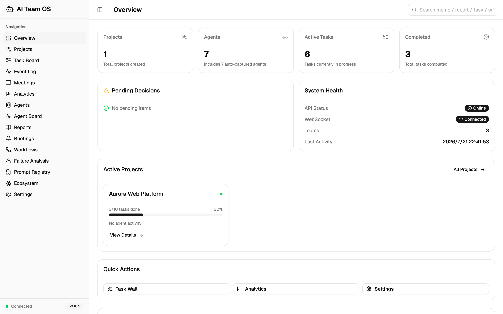

### Team Working — Live Activity Tracking
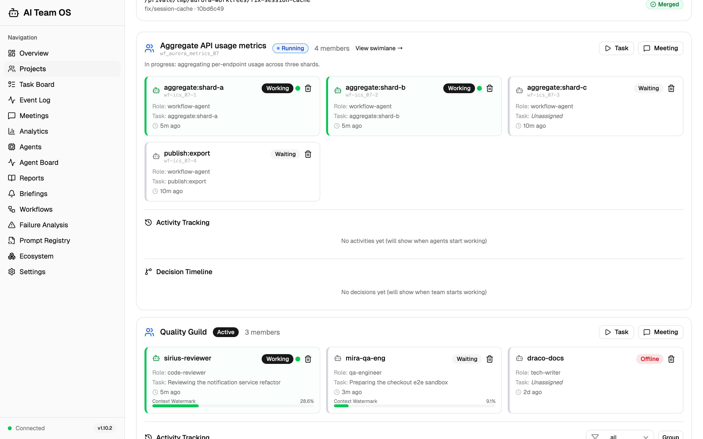

### Task Board
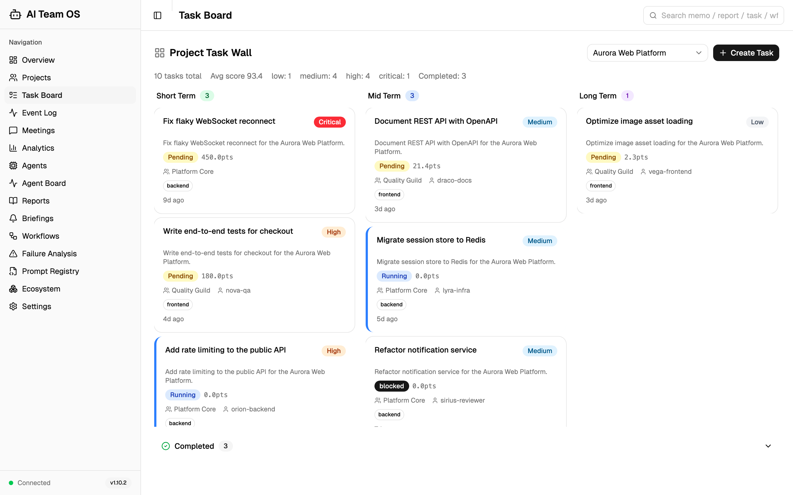

### Workflows — CC ultracode Run Observability
Persistent governance layer for CC ultracode Workflow runs — every run is auto-tracked as a team, surfacing stage progress plus per-agent token and tool-call telemetry.
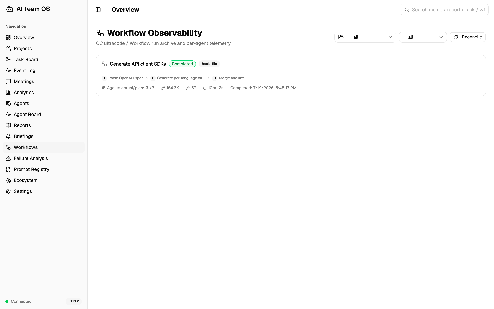

### Workflow Detail — Phase Swim Lane & Per-Agent Telemetry
Drill into a single run: a phase swim lane aligns every stage against one timeline, and a per-agent telemetry table breaks down tokens, tool calls, duration and state per stage — with a failed contract check surfaced in red.
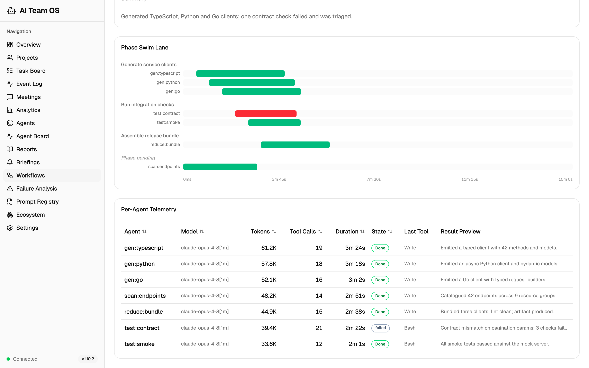

### Project Detail — Decision Timeline


### Project Detail — Leader Context & Worktrees
Per-project roll-up of every attached Leader session with live context watermarks, alongside the Git worktrees in play — flagging any that carry uncommitted changes.
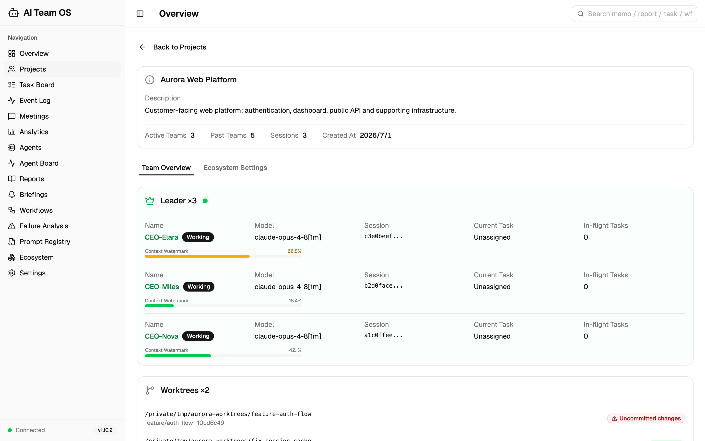

### Agent Board — Live Agent Lanes
Real-time roster of every agent across teams — busy / waiting / offline tallies up top, each card showing its current task, context watermark and last-active time, blending workflow agents with named specialists and their historical trails.
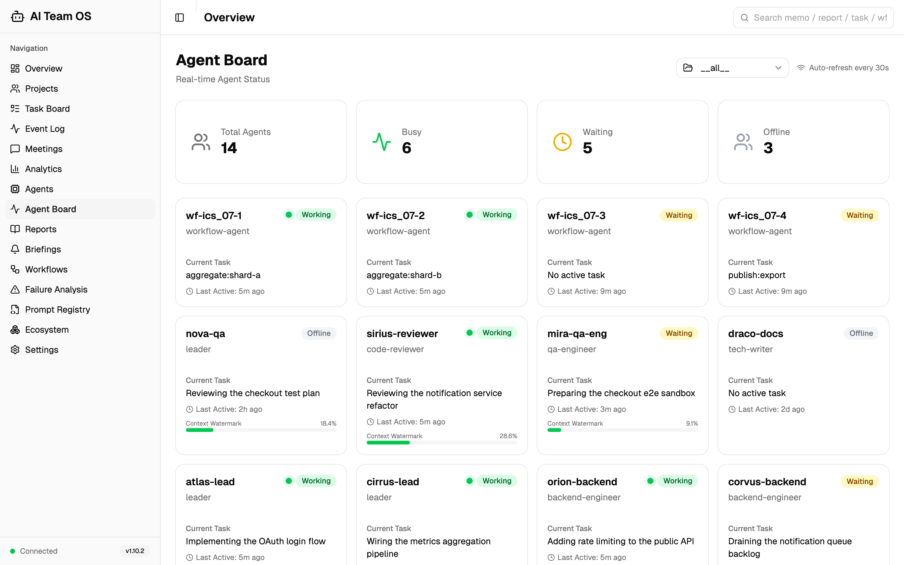

### Meeting Room
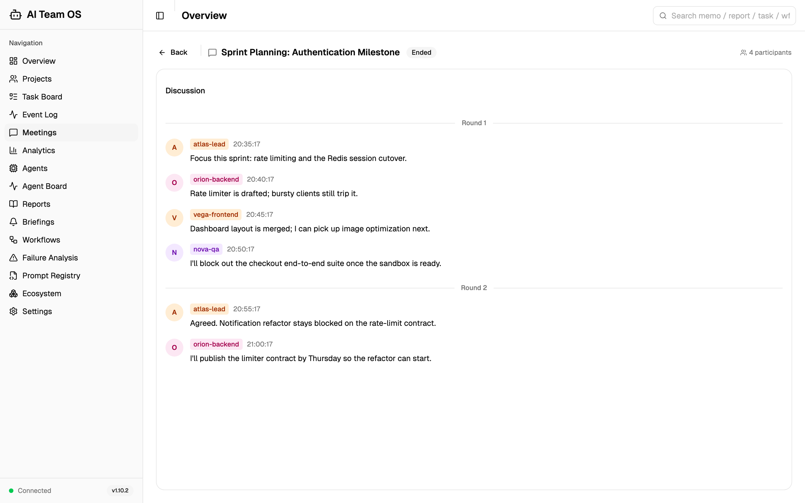

### Ecosystem Research Platform
The ecosystem archive's initial listing — the full set of tracked open-source repositories with stars, primary language and topic tags, ready to open into per-repo research and integration.
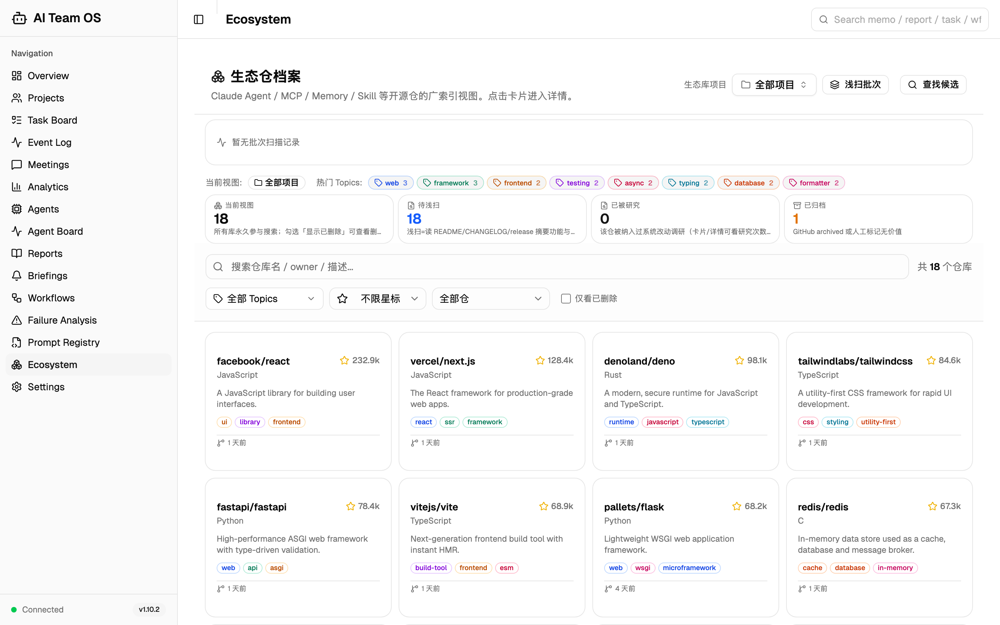

### Activity Analytics
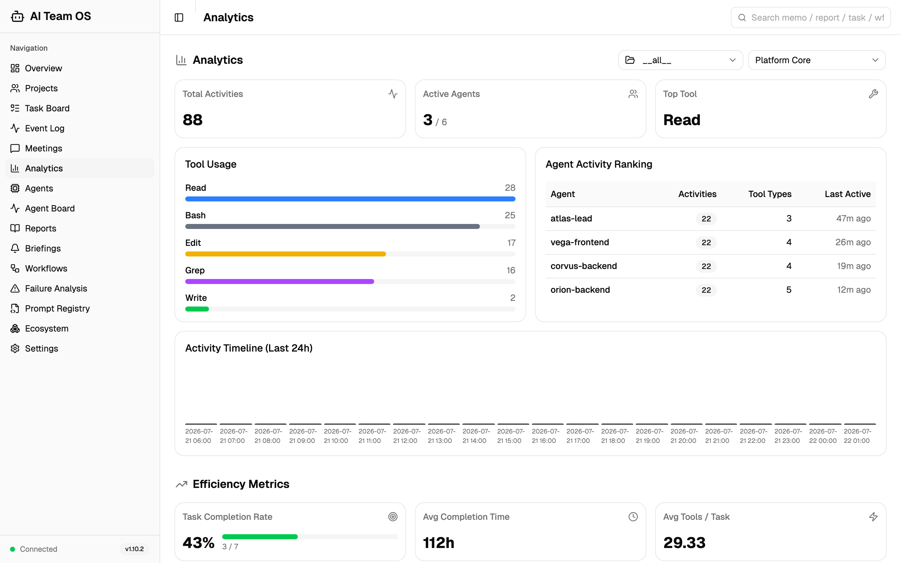

### Event Log
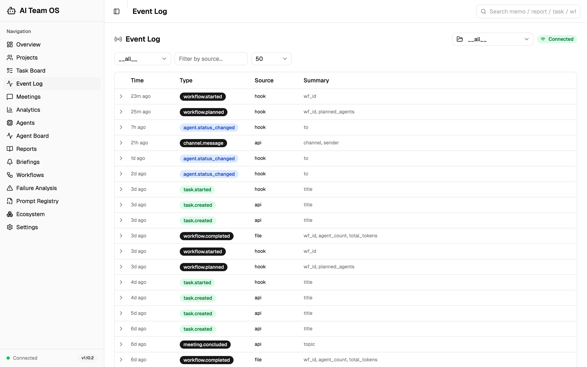

### Auto-Wake System — Autonomous Task Advancement
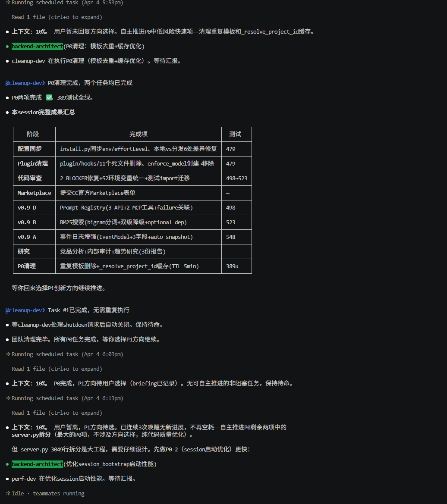

---

## Auto-Wake System

The Leader supports scheduled auto-wake to autonomously advance tasks without supervision:

- Automatically checks context usage and pending tasks every 10 minutes
- When tasks are available, autonomously creates teams and assigns work
- When user decisions are needed, records them asynchronously via the Briefing system
- When context exceeds 80%, auto-saves progress and prompts to open a new session

---

## Ecosystem Integration Recipes

AI Team OS is designed as a **meta-plugin** — it orchestrates other MCP servers rather than reimplementing their capabilities. Pre-built recipes let you integrate popular tools in minutes:

| Recipe | Integrates With | What You Get |
|--------|----------------|--------------|
| **GitHub** | `@modelcontextprotocol/github` | Auto PR creation, issue tracking, code review coordination |
| **Slack** | `@anthropics/slack-mcp` | Team notifications, decision escalation, status broadcasts |
| **Linear** | `linear-mcp-server` | Task sync, sprint tracking, bug triage automation |
| **Full-Stack Team** | GitHub + Slack + Linear | Complete development workflow with cross-tool orchestration |

Use `find_skill(level=2, category="integration")` to discover recipes, or see the full guide: [docs/ecosystem-recipes.md](docs/ecosystem-recipes.md)

---

## CC-First Design Principles

AI Team OS is built specifically for Claude Code, not as a standalone framework:

- **MCP Protocol native**: all 112 MCP tools are registered natively — no custom client, no API wrapper
- **Hook-driven lifecycle**: 15 CC lifecycle events (SessionStart → WorktreeRemove) provide deep integration without modifying CC internals
- **Agent templates as `.md` files**: Installed to `~/.claude/agents/` (global) or `.claude/agents/` (project-level) — CC's native agent system, not a custom abstraction
- **Zero external dependencies at runtime**: No external API calls, no cloud services — runs entirely within your CC subscription
- **Context-aware**: Session bootstrap injects only 5 core rules (down from 23) to minimize context budget impact, with subagent context capped at 60 lines

---

## MCP Tools

<details>
<summary>Expand to see the tool map (112 MCP tools across 16 modules)</summary>

> The tables below are a curated selection — the full inventory lives in `src/aiteam/mcp/tools/` and is machine-counted by `scripts/check_readme_numbers.sh`.

### Team Management

| Tool | Description |
|------|-------------|
| `team_status` | Get team details and member status |
| `team_list` | List all teams |
| `team_briefing` | Get a full team panorama in one call (members + events + meetings + todos) |

### Agent Management

| Tool | Description |
|------|-------------|
| `agent_update_status` | Update Agent status (idle/busy/error) |
| `agent_list` | List team members |
| `agent_template_list` | Get available Agent template list |
| `agent_template_recommend` | Recommend the best Agent template based on task description |

### Task Management

| Tool | Description |
|------|-------------|
| `task_run` | Execute a task with full execution recording |
| `task_status` | Query task execution status |
| `task_create` | Create a new task (`auto_start` supported; `task_type` is accepted but retired — a no-op kept for backward compatibility) |
| `task_update` | Partial update of task fields with auto timestamps |
| `task_memo_add` | Add an execution memo to a task |
| `task_memo_read` | Read task history memos |
| `task_list_project` | List all tasks under a project |

### Meeting System

| Tool | Description |
|------|-------------|
| `meeting_create` | Create a structured meeting (8 templates, keyword auto-select) |
| `meeting_send_message` | Send a meeting message |
| `meeting_read_messages` | Read meeting records |
| `meeting_conclude` | Summarize meeting conclusions |
| `meeting_template_list` | Get available meeting template list |
| `meeting_list` | List all meetings |
| `meeting_update` | Update meeting metadata |

### Channel Communication

| Tool | Description |
|------|-------------|
| `channel_send` | Send a message to a channel (team:/project:/global) with @mention support |
| `channel_read` | Read messages from a channel |
| `channel_mentions` | Get unread @mentions for an agent |


### Debate System

| Tool | Description |
|------|-------------|
| `debate_start` | Start a structured 4-round debate (Advocate→Critic→Response→Judge) |
| `debate_code_review` | Start a code review debate session |


### Intelligence & Analysis

| Tool | Description |
|------|-------------|
| `failure_analysis` | Failure Alchemy — analyze root causes, generate antibody/vaccine/catalyst |
| `decision_log` | Log a decision to the cockpit timeline |
| `context_resolve` | Resolve current context and retrieve relevant background information |

### Memory System

| Tool | Description |
|------|-------------|
| `memory_search` | Search team memory — recency-window recall within scope + pure-Python BM25 rerank (Chinese bigram, no embeddings) |
| `memory_add` | Write a direction-layer memory (preference/correction/design intent, 4 kinds; size guardrails <=40 entries x 400 chars, supersedes swap) |
| `memory_invalidate` | Explicitly invalidate a direction-layer memory (invalidate, never delete — auditable) |
| `memory_list` | List valid direction-layer entries (kind filter; data source for both injection hooks) |
| `memory_reconcile_candidates` | On-demand reconcile coarse pass (zero-LLM): BM25-paired candidate groups + direction-layer inventory + promotion material + operation guide |
| `memory_reconcile_apply` | Apply agent-confirmed reconcile operations (merge / invalidate / score / promote); idempotent, size guardrails enforced on promote |

### Knowledge Layer (v1.8.0)

| Tool | Description |
|------|-------------|
| `unified_search` | Three-arm RRF search across memos / reports / tasks — BM25 full-text + knowledge-graph fanout + exact ID match |
| `link_query` | Query the cross-domain reference graph by node (what references this / what does this reference) |
| `link_trace` | Trace a reference chain from any OS ID (wf_id / commit / task uuid) with evidence snippets |

### Model Governance (v1.8.1)

| Tool | Description |
|------|-------------|
| `model_config_get` | Read discovered available models (transcript-scanned) + the current default startup model |
| `model_config_set` | Set the global default startup model (triple write protection on `~/.claude/settings.json`) |

### Trust & Reliability

| Tool | Description |
|------|-------------|
| `verify_completion` | Verify task completion (status + memo check, anti-hallucination) |

### Analytics

| Tool | Description |
|------|-------------|
| `task_execution_trace` | Get unified execution timeline for a task |
| `diagnose_task_failure` | Auto-diagnose why a task failed |

### Briefing System

| Tool | Description |
|------|-------------|
| `briefing_add` | Add a decision item for user review |
| `briefing_list` | List pending briefing items |
| `briefing_resolve` | Resolve a briefing item with a decision |
| `briefing_dismiss` | Dismiss a briefing item |

### Reports (Database-backed)

| Tool | Description |
|------|-------------|
| `report_save` | Save a report to database with project isolation (research/design/analysis/meeting-minutes) |
| `report_list` | List reports with filtering by project, type, author, topic |
| `report_read` | Read a report by ID |

### Ecosystem Research (42 tools)

The single largest tool family — the full research funnel from scan to integration:

| Tool | Description |
|------|-------------|
| `ecosystem_scan` / `ecosystem_scan_periodic` | GitHub scan by project profile (stars / topics), one-off or periodic |
| `ecosystem_search` / `ecosystem_search_by_capability` | Search the archived research knowledge base |
| `ecosystem_deep_review_request` / `..._request_batch` | Dispatch architecture deep-review agents, single or batched |
| `ecosystem_tag_list` / `..._apply_batch` / `..._dispatch_llm` | Tag rule engine + LLM-assisted tagging |
| `ecosystem_summary_weekly` / `..._top_n` / `..._health` | Weekly digests, top-N and knowledge-base health reports |
| `ecosystem_diff_period` / `ecosystem_index_diff_latest` | Period-over-period diffs + index reconciliation |
| `ecosystem_mark_as_reference` / `ecosystem_start_integration` | Stage-3 marking: keep as reference, or kick off an integration task |
| … | Full family of 42 tools: see `src/aiteam/mcp/tools/ecosystem.py` |


### Prompt Registry

| Tool | Description |
|------|-------------|
| `prompt_effectiveness` | View template effectiveness metrics |

### Project Management

| Tool | Description |
|------|-------------|
| `project_create` | Create a project |
| `project_list` | List all projects |
| `project_update` | Update project settings |
| `project_delete` | Delete a project |
| `project_summary` | Get a quick project status summary |

### System Operations

| Tool | Description |
|------|-------------|
| `os_health_check` | OS health check |
| `os_restart_api` | Restart the OS API server (with safety checks) |
| `event_list` | View the system event stream |
| `agent_activity_query` | Query agent activity history and statistics |
| `find_skill` | 3-layer progressive skill discovery (quick recommend / category browse / full detail) |
| `team_close` | Close a team and cascade-close its active meetings |
| `team_delete` | Delete a team |

</details>

---

## Agent Template Library

25 ready-to-use professional Agent templates with recommendation engine, covering a complete software engineering team. Templates are installed to `plugin/agents/` (project-level) and `~/.claude/agents/` (global, available across all projects).

### Engineering (13 templates)

| Template | Role | Use Case |
|----------|------|----------|
| `engineering-software-architect` | Software Architect | System design, architecture review |
| `engineering-backend-architect` | Backend Architect | API design, service architecture |
| `engineering-frontend-developer` | Frontend Developer | UI implementation, interaction development |
| `engineering-ai-engineer` | AI Engineer | Model integration, LLM applications |
| `engineering-mcp-builder` | MCP Builder | MCP tool development |
| `engineering-code-reviewer` | Code Reviewer | Code quality review, PR review |
| `engineering-database-optimizer` | Database Optimizer | Query optimization, schema design |
| `engineering-devops-automator` | DevOps Automation Engineer | CI/CD, infrastructure |
| `engineering-sre` | Site Reliability Engineer | Observability, incident response |
| `engineering-security-engineer` | Security Engineer | Security review, vulnerability analysis |
| `engineering-rapid-prototyper` | Rapid Prototyper | MVP validation, fast iteration |
| `engineering-mobile-developer` | Mobile Developer | iOS/Android development |
| `engineering-git-workflow-master` | Git Workflow Master | Branch strategy, code collaboration |

### Testing (4 templates)

| Template | Role | Use Case |
|----------|------|----------|
| `testing-qa-engineer` | QA Engineer | Test strategy, quality assurance |
| `testing-api-tester` | API Test Specialist | Interface testing, contract testing |
| `testing-bug-fixer` | Bug Fix Specialist | Defect analysis, root cause investigation |
| `testing-performance-benchmarker` | Performance Benchmarker | Performance analysis, load testing |

### Research & Support (3 templates)

| Template | Role | Use Case |
|----------|------|----------|
| `specialized-workflow-architect` | Workflow Architect | Process design, automation orchestration |
| `support-technical-writer` | Technical Writer | API docs, user guides |
| `support-meeting-facilitator` | Meeting Facilitator | Structured discussion, decision facilitation |

### Management (2 templates)

| Template | Role | Use Case |
|----------|------|----------|
| `management-tech-lead` | Tech Lead | Technical decisions, team coordination |
| `management-project-manager` | Project Manager | Schedule management, risk tracking |

### Debate Roles (2 templates)

| Template | Role | Use Case |
|----------|------|----------|
| `debate-advocate` | Debate Advocate | Propose and defend solutions in structured debates |
| `debate-critic` | Debate Critic | Challenge proposals and find weaknesses |

### Utility (1 template)

| Template | Role | Use Case |
|----------|------|----------|
| `team-member` | Generic Team Member | Default role for general-purpose tasks |

---

## Roadmap

### Completed

- [x] Core Task Wall + Watchdog + Review (the loop state machine was retired in v1.10.x; scoring and the wall live on in `loop/task_wall_engine.py`)
- [x] Failure Alchemy (Antibody + Vaccine + Catalyst)
- [x] Decision Cockpit (Event stream + Timeline + Intent inspection)
- [x] Event-driven Task Wall 2.0 (Real-time push + Intelligent matching)
- [x] Living Team Memory (Knowledge query + Experience sharing)
- [x] What-If Analyzer (Multi-option comparison)
- [x] 8 structured meeting templates with keyword auto-select
- [x] 25 professional Agent templates (23 base + 2 debate roles) with recommendation engine
- [x] 4-layer defense rule system (48+ rules) + behavioral enforcement
- [x] Dashboard Command Center (React 19) — 22 pages including the `/workflows` swimlane, Workflow detail, the Ecosystem suite, and Settings with model governance
- [x] 112 MCP tools across 16 modules
- [x] CC Workflow observability layer (auto-tracking + /workflows dashboard + workflow_list / workflow_get / workflow_reconcile)
- [x] Knowledge layer — zero-LLM reference graph + unified 3-arm RRF search (v1.8.0)
- [x] Model governance — transcript-based model discovery + global default startup model (v1.8.1)
- [x] Machine-checked red-line invariants + one-command preflight (`scripts/preflight.sh`)
- [x] AWARE loop memory system
- [x] find_skill 3-layer progressive discovery
- [x] task_update API for programmatic task management
- [x] Workflow pipeline orchestration (7 templates + auto phase progression) — fully removed in v1.10.x, superseded by CC Workflow observability (`pipeline_stage_history` stays readable)
- [x] 1,959 automated tests, CI green
- [x] Prompt Registry (version tracking retired in v1.10.3 — nothing ever called `/track`, so every version column rendered "-"; effectiveness metrics live on, sourced from real agent activity)
- [x] BM25 as the main memory-retrieval chain (pure-Python Okapi BM25, Chinese bigram, recency-window recall + rerank)
- [x] Event log enhancement (entity_id / entity_type / state_snapshot fields)
- [x] CC Plugin Marketplace submission
- [x] File lock / workspace isolation (acquire/release/check/list + TTL=300s) — retired in v1.10.3; the lock file was empty in every real run, and hook-side edit-conflict warnings replaced it
- [x] Channel communication system (team:/project:/global + @mention)
- [x] Execution pattern memory (success/failure recording + BM25 retrieval) — retired in v1.10.3; the store never held a row, so the injected section was permanently blank
- [x] Guardrails L1 (7 dangerous patterns + PII warnings)
- [x] Alembic database migration system
- [x] Debate mode (4-round structured debate + code review)
- [x] Agent trust scoring system (auto-adjust on task success/failure) — scoring chain retired in v1.10.3 (no caller ever existed); the `trust_score` column stays and `auto_assign` still weights it
- [x] Tool tier draft (informational CORE/ADVANCED grouping — groundwork for context budgeting)
- [x] Agent Watchdog patrol (BUSY-timeout / stuck-task detection; the file-based heartbeat was retired in v1.10.x — CC subagents are one-shot and never polled)
- [x] SRE error budget model (GREEN/YELLOW/ORANGE/RED 4-level response) — retired in v1.10.3; its data directory sat empty for its entire lifetime
- [x] Completion verification protocol (anti-hallucination completion check)
- [x] Ecosystem integration recipes (GitHub/Slack/Linear/Full-stack presets, served by `find_skill`)
- [x] Session bootstrap rule compression (23 → 5 core rules, 60% context reduction)
- [x] Atomic API startup lock (multi-session port conflict prevention)
- [x] Auto port discovery (API finds available port, writes to `api_port.txt`)
- [x] MCP HTTP Streamable endpoint (`/mcp/` on FastAPI)
- [x] PyPI release — frozen at 1.2.0 and deprecated (install via plugin or source instead)
- [x] INSTALL.md CC-assisted installation guide

### In Progress / Planned

- [ ] Multi-tenant isolation
- [ ] Production validation and performance optimization
- [x] Claude Code Plugin Marketplace listing
- [ ] Full integration test suite
- [ ] Documentation site (Docusaurus)
- [ ] Video tutorial series

---

## Project Structure

```
ai-team-os/
├── src/aiteam/
│   ├── api/           — FastAPI REST endpoints (202 routes)
│   ├── mcp/
│   │   ├── server.py  — MCP server entry point
│   │   └── tools/     — 16 tool modules (112 MCP tools)
│   │       ├── agent.py, analytics.py, briefing.py, channels.py,
│   │       ├── ecosystem.py, infra.py, links.py, meeting.py,
│   │       ├── memory.py, project.py, reports.py, task.py,
│   │       ├── task_analysis.py, team.py, watchdog.py, workflows.py
│   │       └── __init__.py  — Toolset registration entry
│   ├── loop/          — Task wall engine + watchdog + failure alchemy
│   ├── meeting/       — Meeting system
│   ├── memory/        — Team memory
│   ├── orchestrator/  — Team orchestrator
│   ├── storage/       — Storage layer (SQLite, WAL journaling)
│   ├── templates/     — Agent template base classes
│   ├── hooks/         — CC Hook scripts (15 lifecycle events)
│   └── types.py       — Shared type definitions
├── plugin/
│   ├── agents/        — 25 Agent templates (.md)
│   └── .claude-plugin/ — Plugin manifest
├── dashboard/         — React 19 frontend (22 pages)
├── scripts/           — preflight + machine-checked invariants (incl. README number check)
├── docs/              — Design documents + ecosystem recipes
├── tests/             — Test suite (1,959 tests)
├── install.py         — One-click install script
└── pyproject.toml
```

---

## Contributing

Contributions are welcome! We especially appreciate:

- **New Agent templates**: If you have prompt designs for specialized roles, PRs are welcome
- **Meeting template extensions**: New structured discussion patterns
- **Bug fixes**: Open an Issue or submit a PR directly
- **Documentation improvements**: Found a discrepancy between docs and code? Please correct it

```bash
# Set up the development environment
git clone https://github.com/CronusL-1141/AI-company.git
cd AI-company
python3 install.py

# One command = every gate CI runs (ruff + eslint + unit tests + machine-checked invariants)
bash scripts/preflight.sh
```

Before submitting a PR, make sure `bash scripts/preflight.sh` passes — it runs the exact gates CI enforces: ruff, eslint, the unit test suite, and the red-line invariant checks in `scripts/check_invariants.sh`. Every one of those invariants (hook copy sync, version lockstep, dist consistency, venv ban, README number drift) was distilled from a real incident in this repo's history — please keep them green.

---

## License

MIT License — see [LICENSE](LICENSE)

---

<div align="center">

**AI Team OS** — The AI company that runs while you sleep.

*Built with Claude Code · Powered by MCP Protocol*

[Docs](docs/) · [Issues](https://github.com/CronusL-1141/AI-company/issues) · [Discussions](https://github.com/CronusL-1141/AI-company/discussions)

</div>

<!-- README numbers are machine-checked against the code: scripts/check_readme_numbers.sh (invariant I6 in scripts/check_invariants.sh). Drift fails CI. -->
