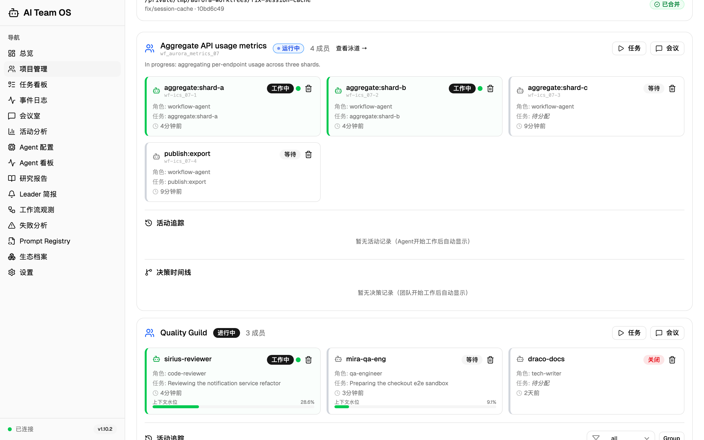
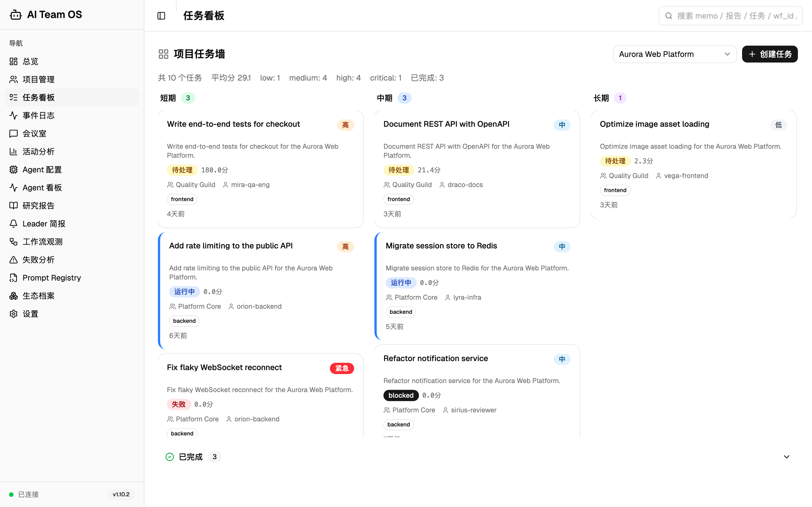
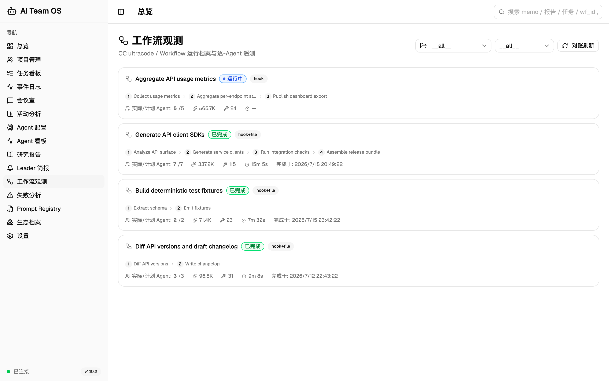
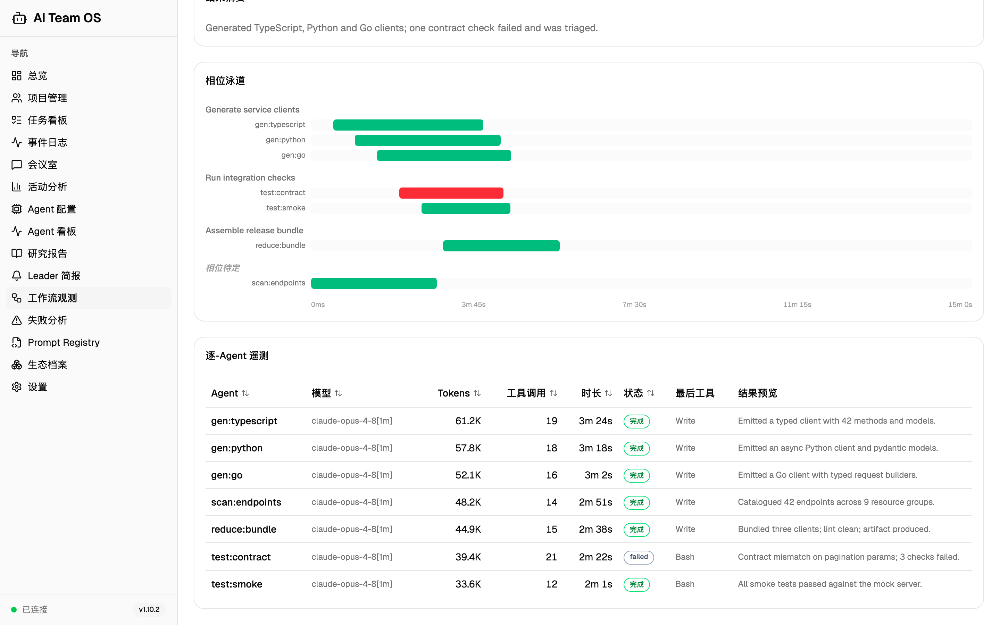
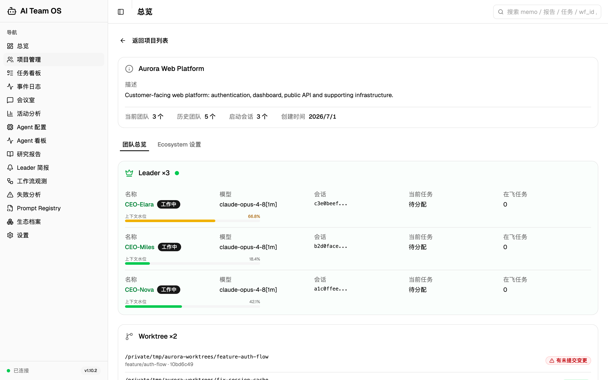
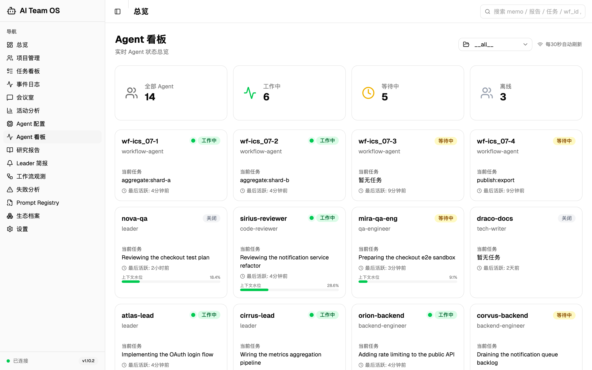

[English](README.md) | [中文](README.zh-CN.md)

# AI Team OS

<!-- Logo placeholder -->
<!--  -->

### 共享上下文，工作有据，代理保持原生。

AI Team OS 是 **Claude Code 与 Codex 共享的工作底座**。任务、项目记忆、报告和团队消息集中留存，在同一个 Dashboard 中追踪跨会话工作。每个宿主继续使用原生 Agent 工具，OS 则提供可持久追溯、便于理解和接续的工作记录。

> 🤝 **Codex 现已可用。** 可以单独使用 Codex 或 Claude Code，也可以让两端共用 OS 的任务墙、项目记忆、报告、信道与 Dashboard。Codex 通过自己的 MCP 和 Hook 配置接入，原生 Agent 工具、宿主设置和 Hook 授信保持独立。各端的接入方式与能力边界见下文。

<!-- 上方 Codex 兼容说明跨版本保留。正式发布时，用新版本已核验的摘要整体替换当前公告，并删除对应预告；历史细节保留在 CHANGELOG.zh-CN.md。 -->

> ⚡ **v1.12.4 — 发布候选：双宿主观测与运行稳定性。** 本批完善 Claude/Codex Leader 归属、原生成员姓名与父队关系、当前工作状态呈现；修复事件与 Analytics 的项目范围、多队汇总及工具完成配对；补充历史会话团队碰撞修复和运行时诊断。发布验证正在进行，本候选尚未发布。
>
> 完整版本历史：[CHANGELOG.zh-CN.md](CHANGELOG.zh-CN.md)

[](https://python.org)
[](LICENSE)
[](https://fastapi.tiangolo.com)
[](https://react.dev)
[](https://modelcontextprotocol.io)
[](https://github.com/CronusL-1141/AI-company)

**116** 个 MCP 工具 · **211** 个 REST 端点 · **23** 个 Dashboard 页面 · **25** 个 Agent 模板 · **42** 个生态研究工具 · **21** 项红线机检不变量

---

**会话可以结束，团队上下文不必随之消失。** 任务、memo、决策和报告保留给下一次获授权的会话，无论它运行在 Claude Code 还是 Codex 中。

---

## 跨会话保留什么

并行 Agent 要真正有用，就必须看清谁负责、实际发生了什么、接下来从哪里继续。AI Team OS 把这些答案保留在单次聊天之外：

- **任务与交接**：归属、进展 memo、阻塞和完成记录留在项目任务墙上。
- **项目记忆与报告**：检索已有决策和证据，不必每次从头重建上下文。
- **团队通讯**：跨宿主收发项目内消息，显式区分读者身份与已读确认。
- **工作可见性**：在同一个 Dashboard 中查看 Leader、成员、工具活动与项目汇总。

OS 记录并呈现工作，所选宿主运行 Agent，由你决定它们获准做什么。

---

## 它是怎么工作的

**你确定范围，每个根会话有自己的 Leader。** Claude Leader 与 Codex Leader 可以共同推进同一项目，无需冒充同一进程，也无需共用宿主配置。

1. 解析当前项目，读取任务墙、相关 memo 和记忆。
2. 由会话 Leader 使用所在宿主的原生 Agent 工具协调获准工作。成员归属父队，Codex 原生 nickname 与角色、任务名分开保留。
3. 通过共享 MCP 工具记录进展、决策和报告。其他会话从相同项目记录和信道接续工作。
4. 在 Dashboard 对照已记录工作与当前活动。候选观测更新明确标注宿主，当前区域只展示新鲜工作证据，等待或历史记录折叠而不删除。

Claude Code 已安装的 Hook 可自动提供启动简报和方向层上下文。Codex 通过 MCP 读取同一份记录，由自己的适配器处理已支持的观测。OS 不替代任一宿主的调度、权限或 Agent 生命周期。

---

## 核心能力

### 1. 跨会话协作

共享项目记录和信道连接不同会话，执行仍留在各自的原生宿主中：

- **每个根会话一位 Leader**：候选将已登记会话与 Claude 文件观测合并，明确标为 `Claude Leader` 或 `Codex Leader`。Codex 原生子线程进入父队，不另立 Leader。
- **当前工作与历史**：新鲜 `busy` 证据驱动当前名单；等待、关闭和陈旧记录作为历史保留。来源或模型未观测到时保持未知。
- **项目与 Worktree 可见性**：交接或续接前查看当前任务、已观测上下文以及未提交的工作。
- **跨宿主消息**：用 `channel_send`、`channel_read` 和 `channel_wait` 显式通讯。等待中的调用可以返回新消息，但不会重启已结束的 Codex 回合。
- **Claude Code 扩展**：既有 fleet 路径可恢复 Claude 会话执行一个回合，已安装 CC Hook 支持压缩检查点、会话注册表观测与后台任务可见性。这些执行和注入路径不是 Codex 功能。

### 2. 记忆系统 v2：共享方向与任务历史

让团队偏好和任务证据跨会话可用，不依赖某一次聊天还剩多少上下文。

- **方向层**（用户偏好 / 纠正 / 设计意图，kind 四类）：按桶限制字符配额（global 1200 + 每 project 1500 + user 300 = 3000 字，单条 ≤400 字），支持 `supersedes` 置换与可审计的失效，不直接删除。写入侧扫描不可见字符、指令覆盖句式和凭据形态。Claude Code 的 SessionStart 与 SubagentStart Hook 注入这些上下文；Codex 通过已配置的工具读取共享记录。
- **情景层**（`task_memos` 台账）：任务级执行备忘独立成表（行级 ID / 失效轴 / 质量分 / scope_path），纯 Python **BM25 中文检索**按需召回，123 条历史零丢失回填。
- **按需整理**（`memory_reconcile`）：零 LLM 粗筛配对候选，Agent 确认后合并 / 失效 / 打分 / 蒸馏提升——"Agent 算、工具存"，不引入任何后台常驻进程。

落点：MCP `memory_add` / `memory_list` / `memory_invalidate` / `memory_search` / `memory_reconcile_candidates` / `memory_reconcile_apply`。

### 3. 工具渐进式加载治理（v1.9.0 新）

按客户端选择 MCP 工具面，不必为每次会话加载全部能力。

- **alwaysLoad 动态轮换**：会话启动期用一条 SQL 按 **7 天真实调用频率**重算高频工具白名单（跨天数 ≥2 挡时段性爆发 + 20% 迟滞防抖，硬顶 ≤5），CC 据此对它们豁免 ToolSearch。不叠加、不手调；统计失败静默降级为全 defer，每次名单落台账可审计。
- **`AITEAM_TOOLSETS` 分组开关**：16 个能力域 toolset，启动期环境变量决定注册哪些模块。`default` 核心档 = task/team/memory/infra/reports（29 工具，硬顶 ≤50），可 `default,ecosystem` 增量挂载——适配有工具数上限的非 CC 客户端。
- **`AITEAM_READONLY` 只读档**：与分组正交叠加，按显式清单剔除全部写工具、只留读工具，适合审计 / 观察者会话。
- **5 个 Claude Code 模板最小权限**：会议主持 / 辩论正反方 / 技术文档 / 项目经理挂 `disallowedTools` 结构性拒绝。Codex 使用自己的原生权限控制，不解释 CC 模板字段。

### 4. Claude Code Workflow / ultracode 观测（v1.7.0）

OS 不拦截 CC 内置的 **ultracode/Workflow**，而是做它的持久化治理层。每次 Workflow 运行都被自动追踪进 OS，无需手动建队：

- **自动追踪**：hook 在运行启动时把每次 Workflow 落成一个 OS "团队"（`workflow-<wf_id>`）
- **Dashboard `/workflows`**：运行卡片实时流 + 相位泳道时间线 + 逐 agent 遥测 —— tokens / 时长 / 状态 / 工具调用数，running 期经 journal 增量 tail 实时推进
- **实测标定的卡死检测**：stall 阈值基于 3,378 个真实 agent 间隔实测标定（p99 = 77.6s，健康 agent 最长静默 173.8s），取最坏健康值的 5.2 倍——宁可迟判，绝不误报
- **项目详情集成**：workflow 团队行内展示 run 摘要（状态 / agent 数 / 耗时 / 完成时刻）+「查看泳道」直达；成员显示语义阶段标签（如 `audit:数据源A`）而非编号
- **Claude Leader 文件观测**：后端可从 Claude 本地记录中读取会话、模型和活跃信息，补充已登记 Leader。Codex 身份使用独立的原生元数据路径。
- **MCP 工具**：`workflow_list`（浏览运行）、`workflow_get`（完整归档 + 逐 agent 明细）、`workflow_reconcile`（OS 离线后从落盘快照对账修复）
- **摄取自愈**：hook 回执锚点 + 落盘快照对账 + reaper 保底三重机制自动弥合离线缺口，落盘的已完成运行会被幂等摄取；跨项目归属按落盘路径 slug 匹配注册项目

### 5. 生态研究平台 — 42 个工具

项目隔离的**知识库**，研究产物随时间累加。每个仓走过 4 阶段（v1.5.0 起的渐进式漏斗），token 高效触发 + append-only 历史：

- **Stage 0 — 入档即浅扫**：新入档仓自动派 `ai-engineer` 出 200-400 字总结（核心功能 / 定位 / 优势）。8 类失败处理 + **自学习挂载点**（同类失败 ≥ 3 仓经 `self_learning_pending` 暴露；队列留出 recorder/searcher 注入位，可接自己的经验库）
- **Stage 1 — 按需架构分析**：用户挑研究方向（"memory_system"）→ 批量派 `backend-architect` 读架构关键文件
- **Stage 2 — 多角度辩论**：触发现有 `debate_start`（**不内建辩论引擎，复用会议系统**）
- **Stage 3 — 参考 / 集成标记**：`mark_as_reference` 加 tag 便于未来快速召回；`start_integration` 触发现有 `task_create` 启动实际集成任务
- **活跃/全量双视图**：数据**永不删除**。stars 跌出阈值的仓保留（仅 `is_active=False`）；涨回自动激活 + 重新入队 Stage 0
- **Dashboard `/ecosystem`**：列表带 stage 徽章 + 研究历程 timeline + 项目筛选下拉 + 候选筛选页 (`/ecosystem/research`) + 项目设置 tab —— OS 内最大的单一工具族

### 6. 知识层 — 引用图谱 + 统一检索（v1.8.0）

OS 记录的一切——任务 memo、报告、任务——都成为可召回的知识：

- **引用图谱（P1a）**：零 LLM 正则抽取器从 memo 和报告中挖出 OS 原生 ID 引用（wf_id / commit / 任务 uuid / `[[记忆]]`），落入 append-only 的 `knowledge_links` 表——图谱是派生视图，随时可从源文本重建
- **统一检索（P1b）**：`/api/search` 三臂 RRF 融合——BM25 全文（中文 bigram 原生）、知识图谱扩散（查一个 ID 连带拉出所有关联物）、精确 ID 前缀/标题匹配
- **Dashboard 顶栏全局搜索框**，配套 MCP 工具 `unified_search` / `link_query` / `link_trace`——用自然语言（"归属铁律怎么修的"）、`wf_` id 或 commit hash 召回过往工作

> **为什么采用零 LLM 检索？** ID 抽取和检索在本地运行，不调用模型，图谱可从源文本重建。把检索结果交给 Agent 阅读，仍会消耗所在宿主的正常上下文预算。

### 7. 任务墙、报告与 Dashboard

治理台账与全景可视化，一切有迹可循：

- **任务墙**：待办 / 进行中 / 已完成实时看板，事件驱动 + 智能匹配 Agent + 卡死检测
- **8 种结构化会议模板**（关键词自动匹配，基于六顶思考帽 / DACI / Design Sprint 方法论）——每次会议必须产出可执行结论，"讨论了但没决定"不是有效结果
- **共享 React 19 Dashboard**：项目任务墙、报告、Agent 活动、事件与 Analytics，同 Claude 专属的 Workflow 和模型治理视图并列呈现。

### 8. 可接续的工作

任务墙为正在运行的 Leader 提供可持久保存的计划：

- 找到下一项已获授权的工作，派原生 Agent 前先记录归属。
- 通过任务 memo 和简报保留阻塞与审批请求。
- 交接进展和证据，让其他会话不必猜测就能继续。
- 把研究发现和评审结论转为明确的后续任务。

是否继续执行，取决于宿主会话及你启用的自动化。记录持久化不等于模型始终运行。

### 9. 基于证据的观测

OS 将已记录事实与推断、缺失信息分开：

- **宿主原生身份**：Claude 文件观测与 Codex 精确原生会话元数据各自独立。Codex 的 nickname 和父链确定成员身份，不靠角色文本或 ID 外观推断。
- **新鲜度与归属**：候选结合已持久化的项目/会话关系及近期活动，将当前工作与历史行分开；事件和 Analytics 项目筛选遵循已记录归属。
- **可靠工具记录**：稳定 Codex 调用 ID 跨重投与 API 重启关联开始、完成。后续 Hook 可在有界限制内补投完成元数据；缺少可信起止证据时，时长保持未知。
- **Workflow 遥测**：Claude Workflow 视图对账落盘 journal 与持久观测，并使用精确项目路径归属。

### 10. Claude Code 模型治理（v1.8.1）

查看 Claude Code transcript 中观测到的模型，并选择 Claude Code 的启动默认值。这里的设置不控制 Codex 选模。

- **基于 transcript 的发现**：本地 CC 记录提供已观测模型名，包括第三方网关名称，缓存 60 秒。这是观测历史，不是账户当前可用性的实时测试。
- **一键设置全局默认启动模型**：写入 `~/.claude/settings.json`，三层写保护——只动 `model` 键、保留 `.bak-aiteam` 备份、原子写入、损坏文件拒写
- **零强制**：只做软提示、绝不拦截，CC Workflow 运行完全豁免

落点：REST `/api/models/{available,default}` · MCP `model_config_get` / `model_config_set` · Dashboard Settings 的模型治理卡。

### 11. 团队协作

协调原生 Agent 与并行 Leader，同时保留各自身份：

- **25 个专业角色模板**（23 个基础 + 2 个辩论角色），含工程、测试、研究和管理推荐引擎。Claude Code 将其安装为原生模板；Codex 保留自己的原生 Agent 配置。
- **部门分组管理**——工程部/测试部/研究部，支持跨部门协作
- **Channel 通讯系统**：`team:` / `project:` / `global` 三种频道 + `@mention` 支持
- **跨宿主消息**：发信、读信和标记已读使用共享信道及不同的读者身份。Claude Code 与 Codex CLI/Desktop 均有开口时未读提示的实测记录；Codex 提示使用结构化 `additionalContext`，不是 Hook 的纯文本 stdout。
- **显式等待**：`channel_wait` 保持一次调用等待，用 `delivery_source` 区分初始补读、事件触发读取和到期末次读取。它与已读确认、Claude Code 可选的会话 watcher 分开，不会在回合结束后唤醒空闲 Codex 会话。
- **辩论模式**：4 轮结构化辩论（Advocate→Critic→Response→Judge）+ `debate_start` / `debate_code_review`
- **教训跨 Agent 传递**：`failure_analysis` 将根因记入项目记忆，供后续会话读取。自动注入取决于已安装的宿主集成，不假定两个运行时行为相同。

### 12. 完全透明

追溯 Dashboard 背后的观测与记录：

- **决策驾驶舱**：事件流 + 决策时间线 + 意图透视，每个决策有迹可循
- **活动追踪**：展示已观测 Agent 状态、当前工作和保留历史，证据缺失时明确显示未知
- **What-If 分析器**：提交前对比多个方案，支持路径模拟和推荐

### 13. 安全与行为强制

OS 检查补充宿主的原生审批与隔离控制。须安装并审阅对应宿主的 Hook，不假定一端的规则会保护另一端：

- **Guardrails L1**：7 种危险模式检测 + PII 警告 + `InputGuardrailMiddleware`
- **Claude Code 派工检查**：CC 专属 Hook 与模板规则校验其 Agent 派工字段，不将这些字段当作 Codex 原生 Agent schema
- **S1 安全规则**：正则扫描拦截破坏性命令（rm -rf、force push、硬编码密钥），覆盖大写标志和 heredoc 模式
- **四层防线规则体系**：48+ 条规则，覆盖工作流、委派、会话和安全层
- **并发编辑告警**：hook 直接按最近编辑事件判定，两个 agent 前后脚碰同一文件即提醒（协作式文件锁工具已于 v1.10.3 退役——实测锁文件在真实运行中从来是空的）
- **Agent Watchdog**：按需 `POST /api/teams/{id}/watchdog/check` + 后台巡检——识别 BUSY 超时 agent、长期 PENDING 任务与依赖已完成却仍 BLOCKED 的任务
- **自巡检**：watchdog 租约巡检 + reaper 对账保底 + kill 前身份校验——OS 不只盯你的 agent，也盯它自己
- **完成验证协议**：`verify_completion` 检查任务状态和 memo 是否存在；产物审查与相关测试仍用于判断结果是否真正正确
- **生态集成配方**：4 个预设配方（GitHub / Slack / Linear / 全栈团队），经 `find_skill(level=2, category="integration")` 查询
- **`find_skill` 三层渐进发现**：快速推荐 → 分类浏览 → 完整详情，降低工具调用开销

### 14. 本地优先的基础设施

OS 不要求另购一套托管模型服务：

- MCP 工具、Hook、存储与 Dashboard 在本地运行。
- 图谱抽取、BM25 检索与整理候选生成不调用模型。
- Agent 推理、读取上下文和 AI 辅助研究使用所配宿主的正常订阅或 API 额度；外部集成可能另有费用。
- 完整 Codex token 与费用归因尚未提供，未知用量不是实测零值。

### 更多能力（旧时代与次要功能 · 仍在运行，按需可查）

- **失败炼金术**：`failure_analysis` 仍随 loop 子系统运行——每次任务失败照常提取根因，产出*抗体*（存入团队记忆防重蹈）/*疫苗*（高频失败转任务前预警）/*催化剂*（分析注入未来 Agent 的 system prompt）。已不再作招牌，但防御规则照常沉淀。
- **AWARE 循环记忆 · `find_skill` 三层发现（技能 + 集成配方）· Prompt Registry**：详见下方工具全表。调度器与 loop 状态机已退役，改用 CC 原生 `Cron*` 与按需工具（CC 非常驻原则）；仅 `wake_agent` 一类排期保留给 fleet 唤醒子系统。

---

## 用它开发这个项目

AI Team OS 管理着自身的开发——而且从 v1.7.0 起，它能用自己的遥测数据自证：

Claude Code 与 Codex 会话使用同一套任务记录和信道交换实现与审查证据。两端的原生执行历史保持独立，OS 提供共同的项目记录。

- v1.7.0 → v1.9.0 的每条功能线——观测层、知识层、模型治理、记忆系统 v2、工具加载治理——都是通过 OS 自己追踪的 CC Workflow 运行交付的。打开 `/workflows`，可以逐条泳道回放系统如何构建自己的功能。
- 对 CrewAI、AutoGen、LangGraph 和 Devin 的竞品研究，通过多 Agent 头脑风暴会议持续喂入路线图——会议纪要就存在 OS 自己的报告库里。
- 它也从自己的事故中学习：`scripts/check_invariants.sh` 里的每条机检不变量，都提炼自本仓库历史上的一次真实事故。

开发中使用的任务墙、报告和观测，同样可用于你的项目。

---

## 与主流方案对比

| 维度 | AI Team OS | CrewAI | AutoGen | LangGraph | Devin |
|------|-----------|--------|---------|-----------|-------|
| **定位** | 原生编程 Agent 的共享 OS | 独立框架 | 独立框架 | 工作流引擎 | 独立 AI 工程师 |
| **集成方式** | MCP + 独立 Claude Code/Codex 适配器 | 独立 Python 运行 | 独立 Python 运行 | 独立 Python 运行 | SaaS 独立产品 |
| **记忆系统** | 共享方向记忆 + 任务 memo + BM25 检索 | 短期上下文 | 短期上下文 | 检查点状态 | 会话内 |
| **工具加载治理** | alwaysLoad 动态轮换 + 分组开关 + 只读档 + 模板最小权限 | 无 | 无 | 无 | 无 |
| **自主运转** | 持久任务协作；执行取决于宿主 | 逐任务执行 | 逐任务执行 | 工作流驱动 | 有限 |
| **会议系统** | 8 种结构化模板，支持关键词自动匹配 | 无 | 有限 | 无 | 无 |
| **失败学习** | 失败炼金术（抗体/疫苗/催化剂） | 无 | 无 | 无 | 有限 |
| **决策透明度** | 决策驾驶舱 + 时间线 | 无 | 有限 | 有限 | 黑盒 |
| **Workflow 可观测性** | CC Workflow 泳道时间线 + 逐 agent 遥测 + 离线对账 | 无 | 无 | 仅图内状态 | 无 |
| **状态来源** | 宿主原生元数据 + 持久观测与 journal | Agent 自报 | Agent 自报 | 进程内状态 | 黑盒 |
| **规则体系** | 四层防线（48+ 条）+ 行为强制 | 有限 | 有限 | 无 | 有限 |
| **Agent 模板** | 25 个 Claude Code 模板 + 共享角色推荐 | 内置角色 | 内置角色 | 无 | 无 |
| **Dashboard** | React 19 可视化 | 商业版 | 无 | 无 | 有 |
| **开源** | MIT | Apache 2.0 | MIT | MIT | 否 |
| **原生编程宿主** | Claude Code 与 Codex，接入路径独立 | 否 | 否 | 否 | 否 |
| **额外成本** | OS 本地运行；宿主与集成仍有使用成本 | 需 API 费用 | 需 API 费用 | 需 API 费用 | $500+/月 |

---

## 系统架构

```text
Claude Code native agents -> CC MCP / hook adapter    \
                                                      > Shared OS API -> SQLite
Codex native agents       -> Codex MCP / hook adapter /       |
                                                             +-> Dashboard
```

数据库保存按项目归属的任务、记忆、报告、信道与观测。各宿主管理自己的脚本、注册、授信和原生 Agent 控制；共享 OS 后端不会合并这些设置。

### 五层技术架构

```
Layer 5: Web Dashboard    — React 19 + TypeScript + Shadcn UI（23 个页面）
Layer 4: CLI + REST API   — Typer + FastAPI
Layer 3: Team Orchestrator — LangGraph StateGraph（可选 extra — 仅 CLI 图执行需要）
Layer 2: Memory Manager   — 内置 SQLite 存储 + 纯 Python BM25 检索
Layer 1: Storage          — SQLite（WAL 日志）· PostgreSQL 支持在路线图上
```

### 宿主适配器

Claude Code 插件与 Codex 适配器通过独立的安装和授信面向同一个 OS 供数。Codex 适配器位于 `plugin/harness/codex/`，观测入口必须与匹配的 helper 模块一同安装。下方事件映射只描述 Claude Code 适配器。

### Hook 系统（13 个脚本 / 15 个生命周期事件 - Claude Code 适配器）

```
SessionStart     → auto_install.py, session_bootstrap.py, send_event.py
                   — 自动安装依赖 + 注入 Leader 简报 / 核心规则 / 团队状态
SubagentStart    → inject_subagent_context.py, send_event.py   — 注入子 Agent OS 规则（2-Action 等）
SubagentStop     → send_event.py                 — 记录子 Agent 生命周期事件
PreToolUse       → workflow_reminder.py, send_event.py
                   — Workflow 追踪提醒 + 事件转发
PostToolUse      → workflow_reminder.py, deep_review_link.py,
                   meeting_ecosystem_writeback.py, send_event.py
TaskCompleted    → cc_task_bridge.py             — 把**已完成**的 CC 任务记到 OS 墙上（只记有主或有依赖链的）
TeammateIdle     → send_event.py                 — CC 自己的队友空闲信号，与 OS 存活判据并列记录（只观察，不改任何状态）
UserPromptSubmit → context_tracker.py            — 上下文追踪
                 → channel_unread.py             — 信道未读徽章
                 → turn_end_guard.py             — 待命提醒（user-prompt 模式）
SessionEnd       → send_event.py                 — 记录会话结束事件
Stop             → send_event.py                 — 记录停止事件
PermissionDenied → permission_denied_recovery.py — 权限拒绝自愈
PreCompact       → pre_compact_save.py           — 把 OS 侧作战态（在飞 agent / 未完成任务 / 待裁决项）定格成检查点
PostCompact      → send_event.py                 — 确认压缩真的发生了（触发后仍可能取消）
WorktreeRemove   → send_event.py                 — 隔离工作区消失
```

---

## 选择安装路径

使用 Claude Code 的 AI 辅助安装时，告诉 Claude Code：
> "Read https://github.com/CronusL-1141/AI-company/blob/master/INSTALL.md and follow the instructions to install AI Team OS"

Claude Code 可读取安装指南并引导完成它的插件配置。Codex 用户应走下方独立的手动路径；Claude 安装器不是 Codex 安装器。

---

> **重要提示**：请将 AI Team OS 安装到系统 Python，而不是项目虚拟环境中。
> 如果安装在 venv 中，AI Team OS 将只在该特定项目中可用。
> 如果当前已激活 venv，请先执行 `deactivate`，再进行安装。

---

## 快速开始

### 前置要求

- Python >= 3.11；开发和验证推荐使用 Python 3.12
- [uv](https://docs.astral.sh/uv/getting-started/installation/)（`pip install uv`）
- 支持 MCP 的 Claude Code 或 Codex；Hook 按宿主分别配置
- Node.js >= 20（Dashboard 前端，可选）

> **国内用户提示**：如果访问 GitHub 较慢，建议配置代理或使用 Gitee 镜像（如有）。

### 方式 A：Claude Code 插件安装

```bash
# 安装 uv（Python 包运行器，MCP 服务器需要）
pip install uv

# 添加 marketplace + 安装
claude plugin marketplace add CronusL-1141/AI-company
claude plugin install ai-team-os

# Restart Claude Code after installation; the first launch configures dependencies

# 随时更新到最新版
claude plugin update ai-team-os@ai-team-os
```

> **提示**：Claude Code 首次启动会配置依赖，耗时取决于本地环境。应核验实际加载的 MCP 工具和已安装 Hook，而不是以启动时长判断成功。

### 方式 B：Claude Code 源码安装

```bash
# Step 1: 克隆仓库
git clone https://github.com/CronusL-1141/AI-company.git
cd AI-company

# Step 2: Run the Claude Code installer (MCP + CC hooks + CC templates + API)
python3 install.py

# Step 3: 重启 Claude Code，一切自动激活
# API 服务器在 MCP 加载时自动启动，无需手动操作
# 验证：在 CC 中运行 /mcp 查看 ai-team-os 工具是否挂载
```

> **依赖说明**：`greenlet`（SQLAlchemy async 在 Apple Silicon 上必需）已默认内置。`LangGraph` 为可选 extra —— 仅 CLI 图执行路径需要：`pip install 'ai-team-os[langgraph]'`。

### 方式 C：Codex 手动接入

Codex 使用共享 OS 后端，并独立安装自己的适配器：

1. 复用已有 OS 服务，或在源码 checkout 中用系统解释器执行 `python3 -m pip install -e .` 安装 Python 包。遵循该解释器的包管理策略，不要仅为配置 Codex 而运行 Claude 安装器。
2. 在 Codex 的 MCP 设置中连接现有 API 的 `/mcp/` 端点，或配置 stdio：命令 `python3`，参数 `-m aiteam.mcp.server`。解释器应导入目标源码 checkout，并使用相同 OS 数据目标。
3. 将计划启用的 Codex Hook 入口复制到 Codex 专属目录。观测入口 `send_event_codex.py` 需要 `plugin/harness/codex/hooks/` 中匹配的 `codex_observation.py`、`codex_completion_delivery.py` 和 `hook_core.py`，须成套复制。开口时未读提示入口为 `channel_unread_codex.py`。
4. 在 Codex 注册所选命令，并在其自身 Hook 授信控制中审阅。保留既有安全守卫，不改 Claude 设置或 Claude Hook 文件。
5. 用一次真实工具调用核对已安装 Hook、API 记录与 Dashboard。复制文件、加载 MCP 工具表或批准授信，单独都不是端到端检查。

本候选的新观测链仍待最终宿主自动触发验收。Codex 路径不安装 Claude Code 的启动简报、模板注入或 fleet/watcher 执行机制。

### 验证安装

```bash
# Use the actual running API port; 8000 is the usual default.
curl http://localhost:8000/api/health
# Expected: {"status": "ok"}
```

在任一宿主中，为当前项目调用 `context_resolve`、读取一条任务 memo，并在 Dashboard 查看同一项目。验证观测改动时，将真实原生工具调用及完成回执与持久活动记录对账，再核对原生成员姓名、父队和状态。运行 API、Dashboard 产物与已安装 Hook 文件分别检查。

### 对第一个会话说的第一句话

配置好所选宿主后，将共享记录纳入工作方式：

> 「在 AI Team OS 中解析当前项目，读取任务墙和相关 memo，并在那里记录进展与决策。使用你自己的原生 Agent 工具完成已获授权的工作。」

Claude Code 已安装的 `/os-help` 命令可介绍它的工作流。Codex 使用原生工具发现或另行配置的 OS 帮助技能；Claude slash command 不会自动变成 Codex 命令。

### 工具加载配置（可选）

MCP server 可按客户端暴露完整工具清单或较小的工具集。两个环境变量在 server 启动时读取；配置变化在下次启动时生效，不改变已经运行的 server。

**`AITEAM_TOOLSETS`** - 选择注册哪些能力域分组：

- 未设置或 `all` - 完整注册清单（向后兼容）
- `default` - 仅核心组（`task,team,memory,infra,reports` = 29 工具，硬顶 <=50）
- 逗号分隔的组名列表，可混入 `default` 做增量加载，如 `AITEAM_TOOLSETS=default,ecosystem`
- 未知组名 stderr 警告并忽略（配置写错绝不拉不起 server）

**`AITEAM_READONLY=1`** - 与分组正交叠加，注册后剔除全部写工具（create/update/delete/apply/send/... 及 `os_restart_api`），只留读工具。适合审计/观察者会话。

16 个分组（带 * 为 default 组）：

| 组名 | 工具数 | 组名 | 工具数 | 组名 | 工具数 |
|---|---|---|---|---|---|
| task * | 8 | project | 6 | links | 3 |
| team * | 5 | agent | 7 | channels | 3 |
| memory * | 6 | meeting | 10 | task_analysis | 2 |
| infra * | 7 | briefing | 4 | watchdog | 1 |
| reports * | 3 | analytics | 2 | workflows | 3 |
| ecosystem | 42 | | | | |

```bash
# 示例：精简核心 + ecosystem，只读档
AITEAM_TOOLSETS=default,ecosystem AITEAM_READONLY=1 python3 -m aiteam.mcp.server
```

### 移除一个宿主的集成

```bash
# Claude Code plugin:
claude plugin uninstall ai-team-os

# Preview the Claude Code source uninstaller before deciding what to remove:
python scripts/uninstall.py --dry-run
```

Codex 只移除自身的 MCP/Hook 注册和独立复制的适配器文件。删除共享 OS 数据或执行完整源码卸载前，先检查计划、备份记录，并确认其他宿主已不再使用后端。移除一端集成，不等于获准删除共享数据库。

### 启动 Dashboard（可选）

```bash
cd dashboard
npm install
npm run dev
# 访问 http://localhost:5173
```

---

## Dashboard 截图

这些截图用于展示界面，可能早于本候选的观测更新。当前行为以说明文字和未发布记录为准；截图不等于运行中环境的实测。

### 指挥中心


### 团队实时工作 — 活动追踪


### 任务看板


### 工作流观测 — CC ultracode 运行观测
为 CC ultracode 的 Workflow 运行提供持久化治理层——每次运行自动追踪成一个团队，呈现阶段进度与逐 Agent 的 Token、工具调用遥测。


### 工作流详情 — 相位泳道与逐-Agent 遥测
下钻单次运行：相位泳道将各阶段排布在同一条时间轴上，逐-Agent 遥测表拆解每个阶段的 Token、工具调用、耗时与状态——失败的契约检查以红条醒目标出。


### 项目详情 — 决策时间线


### 项目详情 — Leader 上下文与 Worktree
候选显示有新鲜工作证据的 Leader、明确宿主标签及可用的上下文观测，并列出 Git worktree 与未提交变更。缺少上下文时保持未知，历史 Leader 不补入当前名单。


### Agent 泳道 — 实时 Agent 看板
候选按团队展示有新鲜工作证据的 Leader 与成员，保留 Codex 原生成员姓名，将等待和历史记录单独折叠。角色、任务与可用上下文观测分别呈现。


### 会议室


### 生态研究平台
生态仓档案的初始列表——完整呈现纳管的开源仓库，附星标、主语言与主题标签，可点击卡片进入逐仓研究与集成。


### 活动分析


### 事件日志


### Claude Code 会话 Watcher：历史演示


---

## 等信、通知与继续工作

这些是不同的操作，不是一套通用后台调度器：

- **开口时提示**：已安装未读 Hook 可在宿主开始下一次用户触发的回合时显示消息。
- **显式等待**：任一宿主均可在活动回合中调用 `channel_wait`，返回消息或超时，不自动标记已读。
- **Claude Code 会话 watcher**：既有 CC 专属 watcher 在启用并具备相应读者身份与权限时，可驱动存活的 Claude 会话。
- **Codex 回合结束后**：本候选不提供来信自动唤醒。持久收件记录保留给后续回合读取。

通知、授权与执行分别判断。存在待办或收到新消息，不等于获准启动无关工作。

---

## 生态集成配方

AI Team OS 可围绕其他 MCP server 协调记录与交接，不必重新实现它们的能力。配方描述的集成需要在实际执行工作的宿主中配置并授权：

| 配方 | 集成对象 | 能力 |
|------|---------|------|
| **GitHub** | `@modelcontextprotocol/github` | 自动创建 PR、Issue 跟踪、代码审查协调 |
| **Slack** | `@anthropics/slack-mcp` | 团队通知、决策升级、状态广播 |
| **Linear** | `linear-mcp-server` | 任务同步、Sprint 跟踪、Bug 分流自动化 |
| **全栈团队** | GitHub + Slack + Linear | 完整开发工作流，跨工具编排 |

使用 `find_skill(level=2, category="integration")` 发现配方，或查看完整指南：[docs/ecosystem-recipes.md](docs/ecosystem-recipes.md)

---

## 共享 OS，原生宿主

- **共享项目服务**：同一套 MCP 工具、API、数据库与 Dashboard 保存任务、记忆、报告、消息和观测。
- **独立适配器**：Claude Code 与 Codex 各自保留脚本、注册、授信和原生派工控制。
- **先证据后推断**：用原生元数据绑定观测身份与工具调用，保留未知，不靠姓名或时间戳猜测。
- **项目范围视图**：任务、事件和 Analytics 查询使用已记录项目归属，多支团队可共同贡献而不相互覆盖汇总值。
- **宿主专属上下文投递**：Claude Code 的 bootstrap 和模板 Hook 属于其自身集成。Codex 可读取共享上下文，不继承 Claude 配置。

---

## 常见问题

### 必须同时使用 Claude Code 和 Codex 吗？

不必。任一端都可使用共享 OS 服务。接入两端可做跨宿主交接，不要求合并配置或凭据。

### 回合结束后，OS 会继续运行 Codex 吗？

不会。`channel_wait` 是显式等待中的调用，开口时未读提示也需要新的回合。本候选不增加空闲 Codex 会话的唤醒机制。

### 为什么模型、时长或用量显示未知？

OS 只展示能归属的证据。原生元数据缺失时保持未知，工具时长需要可信时刻，完整 Codex token/费用归因尚未完成。历史调用没有可靠 ID 时，不靠猜测标记完成。

### 为什么文件已更新，Dashboard 仍可能显示旧行为？

运行 API、构建后的 Dashboard、已安装适配器文件与宿主 Hook 授信是不同层。应配套更新，再用实际事件核验整条链路；仅重载 MCP 不会同时替换所有层。

---

## MCP 工具一览

<details>
<summary>展开查看工具全景（116 个 MCP 工具，分布在 16 个模块）</summary>

> 下表为精选摘录——全量清单在 `src/aiteam/mcp/tools/`，由 `scripts/check_readme_numbers.sh` 机器计数校验。

### 团队管理

| 工具 | 说明 |
|------|------|
| `team_status` | 获取团队详情和成员状态 |
| `team_list` | 列出所有团队 |
| `team_briefing` | 一次调用获取团队全景简报（成员+事件+会议+待办） |

### Agent 管理

| 工具 | 说明 |
|------|------|
| `agent_update_status` | 更新已记录的 Agent 状态 |
| `agent_list` | 列出团队成员 |
| `agent_template_list` | 获取可用的 Agent 模板列表 |
| `agent_template_recommend` | 根据任务描述推荐最适合的 Agent 模板 |

### 任务管理

| 工具 | 说明 |
|------|------|
| `task_run` | 执行任务并记录全程 |
| `task_status` | 查询任务执行状态 |
| `task_create` | 创建新任务（支持 `auto_start`；`task_type` 参数仍接受但已退役，内部 no-op，仅为向后兼容保留） |
| `task_update` | 局部更新任务字段，自动打时间戳 |
| `task_list_project` | 列出项目下所有任务 |
| `task_memo_add` | 为任务添加执行备忘记录 |
| `task_memo_read` | 读取任务历史备忘 |

### 会议系统

| 工具 | 说明 |
|------|------|
| `meeting_create` | 创建结构化会议（8 种模板，关键词自动匹配） |
| `meeting_send_message` | 发送会议消息 |
| `meeting_read_messages` | 读取会议记录 |
| `meeting_conclude` | 总结会议结论 |
| `meeting_template_list` | 获取可用会议模板列表 |
| `meeting_list` | 列出所有会议 |
| `meeting_update` | 更新会议元数据 |

### Channel 通讯

| 工具 | 说明 |
|------|------|
| `channel_send` | 向频道发送消息（team:/project:/global），支持 @mention |
| `channel_read` | 读取频道消息 |
| `channel_wait` | 补读定向收件箱，然后以 WebSocket 等待对端消息；纯读、不自动 ACK |
| `channel_mentions` | 获取 Agent 的未读 @提及 |

`channel_wait` 保持一次 MCP 调用等待：先订阅，再补读按项目、收件人和发送者隔离的
收件箱，随后由事件触发返回持久化正文。不调度模型、不启动后台守护，也不能重新启动
已结束的 Desktop 回合。默认等待 45 秒，最大 300 秒；`io_timeout_seconds` 独立控制
连接、订阅确认和每次 HTTP 读取预算，默认 10 秒、最大 60 秒。客户端请求超时应大于
`timeout_seconds + 4 * io_timeout_seconds + 5`。取消须发送 MCP 取消通知或关闭会话，
仅本地超时或取消本地协程不会通知
服务端。断线明确报错并返回已验证的 `resume_cursor`，不伪装空收件箱；首次用 `since`
指定历史下界，之后使用实际
处理页的 `next_cursor` 续读。游标绑定收件范围，按 SQLite 插入顺序推进，不因旧时间戳
的晚提交而漏信；锚点被删除或复用时明确报错，不静默跳页。等待从不自动标已读，旧徽章
的时间戳 ACK 与这个交付游标相互独立。重试未处理页可能重复返回，以消息 ID 去重。

成功响应中的 `delivery_source` 标明返回分支：`replay` 是初始补读，`event` 是收到候选
WebSocket 事件后补读，`timeout_read` 是等待到期后的末次补读。末次补读仍可能返回消息，
空页才返回 `status=timeout`。该字段证明执行了哪条分支，不保证页内每条消息都有对应
推送帧；错误响应不声明交付来源。


### 辩论系统

| 工具 | 说明 |
|------|------|
| `debate_start` | 启动 4 轮结构化辩论（Advocate→Critic→Response→Judge） |
| `debate_code_review` | 启动代码审查辩论会话 |


### 智能分析

| 工具 | 说明 |
|------|------|
| `failure_analysis` | 失败炼金术——分析失败根因，生成抗体/疫苗/催化剂 |
| `decision_log` | 记录决策到驾驶舱时间线 |
| `context_resolve` | 解析当前上下文，获取相关背景信息 |

### 记忆系统

| 工具 | 说明 |
|------|------|
| `memory_search` | 检索团队记忆 — scope 内近期窗口粗召回 + 纯 Python BM25 重排（中文 bigram，无向量/embedding） |
| `memory_add` | 写方向层记忆（偏好/纠正/设计意图，kind 四类；桶字符配额 1200/1500/300、单条 ≤400 字，supersedes 置换） |
| `memory_invalidate` | 显式失效一条方向层记忆（按 id 或唯一子串定位；失效不删除，可审计） |
| `memory_list` | 列共享方向层有效条目，可按 kind 过滤 |
| `memory_reconcile_candidates` | 按需整理·粗筛（零 LLM）：BM25 配对候选组 + 方向层清单 + 蒸馏素材 + 操作说明 |
| `memory_reconcile_apply` | 应用 agent 确认后的整理操作（合并 / 失效 / 打分 / 提升）；幂等，promote 走体量红线 |

### 知识层（v1.8.0）

| 工具 | 说明 |
|------|------|
| `unified_search` | 跨 memo / 报告 / 任务的三臂 RRF 检索 — BM25 全文 + 知识图谱扩散 + 精确 ID 匹配 |
| `link_query` | 按节点查询跨域引用图谱（谁引用了它 / 它引用了谁） |
| `link_trace` | 从任意 OS ID（wf_id / commit / 任务 uuid）追踪引用链，附证据片段 |

### Claude Code 模型治理（v1.8.1）

| 工具 | 说明 |
|------|------|
| `model_config_get` | 读取已观测 Claude Code 模型名及其启动默认值 |
| `model_config_set` | 受保护地修改 Claude Code 设置中的启动默认值，不控制 Codex |

### 信任与可靠性

| 工具 | 说明 |
|------|------|
| `verify_completion` | 验证任务完成状态（状态 + memo 检查，防幻觉） |

### 分析

| 工具 | 说明 |
|------|------|
| `task_execution_trace` | 获取任务的统一执行时间线 |
| `diagnose_task_failure` | 自动诊断任务失败原因 |

### 简报系统

| 工具 | 说明 |
|------|------|
| `briefing_add` | 添加待用户审查的决策项 |
| `briefing_list` | 列出待处理的简报项 |
| `briefing_resolve` | 以决策解决简报项 |
| `briefing_dismiss` | 忽略简报项 |

### 报告（数据库存储）

| 工具 | 说明 |
|------|------|
| `report_save` | 保存报告到数据库，支持项目隔离（研究/设计/分析/会议纪要） |
| `report_list` | 列出报告，支持按项目、类型、作者、主题过滤 |
| `report_read` | 通过报告 ID 读取报告 |

### 生态研究（42 个工具）

OS 内最大的单一工具族——从扫描到集成的完整研究漏斗：

| 工具 | 说明 |
|------|------|
| `ecosystem_scan` / `ecosystem_scan_periodic` | 按项目画像（stars / topics）扫 GitHub，单次或周期 |
| `ecosystem_search` / `ecosystem_search_by_capability` | 检索已入档的研究知识库 |
| `ecosystem_deep_review_request` / `..._request_batch` | 派发架构深评 agent，单发或批量 |
| `ecosystem_tag_list` / `..._apply_batch` / `..._dispatch_llm` | 标签规则引擎 + LLM 辅助打标 |
| `ecosystem_summary_weekly` / `..._top_n` / `..._health` | 周报速览、Top-N 与知识库健康报告 |
| `ecosystem_diff_period` / `ecosystem_index_diff_latest` | 期间对比 diff + 索引对账 |
| `ecosystem_mark_as_reference` / `ecosystem_start_integration` | Stage 3 标记：留作参考，或直接发起集成任务 |
| … | 42 个工具全家族见 `src/aiteam/mcp/tools/ecosystem.py` |


### Prompt Registry

| 工具 | 说明 |
|------|------|
| `prompt_effectiveness` | 查看模板效果指标 |

### 项目管理

| 工具 | 说明 |
|------|------|
| `project_create` | 创建项目 |
| `project_list` | 列出所有项目 |
| `project_update` | 更新项目设置 |
| `project_delete` | 删除项目 |
| `project_summary` | 获取项目快速状态摘要 |

### 系统运维

| 工具 | 说明 |
|------|------|
| `os_health_check` | 健康检查，并按需校正已核验的本地 API PID 台账 |
| `os_restart_api` | 安全重启；`dry_run=true` 预检导入，`source_root` 指定开发 checkout |
| `event_list` | 查看系统事件流 |
| `agent_activity_query` | 查询 Agent 活动历史和统计数据 |
| `find_skill` | 三层渐进技能发现（快速推荐 / 分类浏览 / 完整详情） |
| `team_close` | 关闭团队并级联关闭其所有活跃会议 |
| `team_delete` | 删除团队 |

开发时可先调用 `os_restart_api(source_root="/绝对仓库路径", dry_run=true)`，只检查导入，
不关闭服务。正式重启切换工作目录时保留原数据库目标。健康检查仅认领管理端口上身份已核验
的进程，不认领其他监听者；这是按需自愈，不是后台守护。
`psutil` 已显式声明为运行依赖。POSIX 缺失该依赖时仍可只读核验已有 API 和已确认死亡
的锁持有者；身份不明时不杀进程、不启动重复服务。健康检查读取当前端口文件或显式
API 地址，支持非默认端口。

事件推送以有超时的并发发送隔离慢 WebSocket 客户端；Dashboard 在 200 毫秒窗口内合并
查询刷新，正常等待中的请求不因新事件被取消。刷新超过 30 秒才取消该次捕获的请求，
不会误取消同一查询键上的后续新请求；后续事件可重试，不会永久卡住该类刷新。
普通 API 请求最多使用五个 SQLite 并发槽中的四个，
给 hook 事件保留一个槽，总并发上限仍为五个。

</details>

---

## Agent 模板库

`plugin/agents/` 随包提供 25 个专业角色模板，并有共享目录与推荐工具。Claude Code 可将其安装为原生 Agent 定义，包括 `~/.claude/agents/` 中的全局副本。Codex 可参考角色职责，但派工、姓名和权限保留原生方式；CC 模板 frontmatter 不是 Codex 的安装格式。

### 工程部（13 个模板）

| 模板名 | 角色 | 适用场景 |
|--------|------|---------|
| `engineering-software-architect` | 软件架构师 | 系统设计、架构评审 |
| `engineering-backend-architect` | 后端架构师 | API 设计、服务架构 |
| `engineering-frontend-developer` | 前端开发工程师 | UI 实现、交互开发 |
| `engineering-ai-engineer` | AI 工程师 | 模型集成、LLM 应用 |
| `engineering-mcp-builder` | MCP 构建专家 | MCP 工具开发 |
| `engineering-code-reviewer` | 代码审查工程师 | 代码质量审查、PR 审查 |
| `engineering-database-optimizer` | 数据库优化师 | 查询优化、Schema 设计 |
| `engineering-devops-automator` | DevOps 自动化工程师 | CI/CD、基础设施 |
| `engineering-sre` | 站点可靠性工程师 | 可观测性、故障处理 |
| `engineering-security-engineer` | 安全工程师 | 安全审查、漏洞分析 |
| `engineering-rapid-prototyper` | 快速原型工程师 | MVP 验证、快速迭代 |
| `engineering-mobile-developer` | 移动端开发工程师 | iOS/Android 开发 |
| `engineering-git-workflow-master` | Git 工作流专家 | 分支策略、代码协作 |

### 测试部（4 个模板）

| 模板名 | 角色 | 适用场景 |
|--------|------|---------|
| `testing-qa-engineer` | QA 工程师 | 测试策略、质量保障 |
| `testing-api-tester` | API 测试专家 | 接口测试、契约测试 |
| `testing-bug-fixer` | Bug 修复专家 | 缺陷分析、根因排查 |
| `testing-performance-benchmarker` | 性能基准测试师 | 性能分析、压测 |

### 研究与支持（3 个模板）

| 模板名 | 角色 | 适用场景 |
|--------|------|---------|
| `specialized-workflow-architect` | 工作流架构师 | 流程设计、自动化编排 |
| `support-technical-writer` | 技术文档工程师 | API 文档、用户指南 |
| `support-meeting-facilitator` | 会议主持人 | 结构化讨论、决策推进 |

### 管理层（2 个模板）

| 模板名 | 角色 | 适用场景 |
|--------|------|---------|
| `management-tech-lead` | 技术 Lead | 技术决策、团队协调 |
| `management-project-manager` | 项目经理 | 进度管理、风险跟踪 |

### 辩论角色（2 个模板）

| 模板名 | 角色 | 适用场景 |
|--------|------|---------|
| `debate-advocate` | 辩论倡导者 | 在结构化辩论中提出和捍卫方案 |
| `debate-critic` | 辩论评论者 | 挑战提案、发现弱点 |

### 通用模板（1 个）

| 模板名 | 角色 | 适用场景 |
|--------|------|---------|
| `team-member` | 通用团队成员 | 通用型任务的默认角色 |

---

## 路线图

### 已发布与历史里程碑

- [x] 核心任务墙 + Watchdog + 回顾（loop 状态机已于 v1.10.x 退役，评分与任务墙保留在 `loop/task_wall_engine.py`）
- [x] 失败炼金术（抗体 + 疫苗 + 催化剂）
- [x] 决策驾驶舱（事件流 + 时间线 + 意图透视）
- [x] 事件驱动任务墙 2.0（实时推送 + 智能匹配）
- [x] 团队活记忆（知识查询 + 经验共享）
- [x] What-If 分析器（多方案对比推荐）
- [x] 8 种结构化会议模板，支持关键词自动匹配
- [x] 25 个专业 Agent 模板（23 基础 + 2 辩论角色），含推荐引擎
- [x] 四层防线规则体系（48+ 条规则）+ 行为强制
- [x] Dashboard 指挥中心（React 19）— 23 个页面，含 `/workflows` 泳道、Workflow 详情、Ecosystem 套件、`/usage` 用量归因与模型治理 Settings
- [x] 116 个 MCP 工具，分布在 16 个模块中
- [x] CC Workflow 观测层（自动追踪 + /workflows Dashboard + workflow_list / workflow_get / workflow_reconcile）
- [x] 知识层——零 LLM 引用图谱 + 三臂 RRF 统一检索（v1.8.0）
- [x] Claude Code 模型治理：基于 transcript 的发现与启动默认值（v1.8.1）
- [x] 红线不变量机检 + 一键预检（`scripts/preflight.sh`）
- [x] AWARE 循环记忆系统
- [x] find_skill 三层渐进发现
- [x] task_update API，支持程序化任务管理
- [x] 工作流管道编排（7 种模板 + 自动阶段推进）——已于 v1.10.x 整域删除，由 CC Workflow 观测层接替（`pipeline_stage_history` 存量数据只读可查）
- [x] 在 CI 中维护自动化单测和前端回归套件
- [x] Prompt Registry（版本追踪已于 v1.10.3 退役——全仓无人调 `/track`，版本列对每一行都渲染 "-"；效果统计保留，数据来自真实 agent 活动）
- [x] BM25 接入检索主链路（纯 Python Okapi BM25，中文 bigram，近期窗口粗召回 + 重排）
- [x] 事件日志增强（entity_id / entity_type / state_snapshot 字段）
- [x] CC Plugin Marketplace 正式提交
- [x] 文件锁/工作区隔离（acquire/release/check/list + TTL=300s）——v1.10.3 退役；实测锁文件在真实运行中恒为空，改由 hook 侧编辑冲突告警承担
- [x] Channel 通讯系统（team:/project:/global + @mention）
- [x] 执行模式记忆（成功/失败记录 + BM25 检索）——v1.10.3 退役；存储恒空，注入段永远是空段
- [x] Guardrails L1（7 种危险模式 + PII 警告）
- [x] Alembic 数据库迁移系统
- [x] 辩论模式（4 轮结构化辩论 + 代码审查）
- [x] Agent 信任评分系统（任务成功/失败自动调整）——评分链已于 v1.10.3 退役（从无调用方）；`trust_score` 列保留，`auto_assign` 仍按它加权
- [x] 工具分层草案（informational CORE/ADVANCED 清单——为上下文预算优化预留）
- [x] Agent Watchdog 巡检（BUSY 超时 / 卡死任务检测；文件心跳已于 v1.10.x 退役——CC 子 agent 是一次性进程，从不轮询）
- [x] SRE 错误预算模型（GREEN/YELLOW/ORANGE/RED 四级响应）——v1.10.3 退役；数据目录终其一生没有过一个文件
- [x] 完成验证协议（防幻觉完成检查）
- [x] 生态集成配方（GitHub/Slack/Linear/全栈团队预设）
- [x] Session bootstrap 规则压缩（23 → 5 条核心规则，上下文减少 60%）
- [x] API 原子启动锁（多 session 端口冲突防护）
- [x] 自动端口发现（API 自动寻找空闲端口，写入 `api_port.txt`）
- [x] MCP HTTP Streamable 端点（`/mcp/` 挂载到 FastAPI）
- [x] PyPI 发布——停在 1.3.4（2026-04）后弃用；wheel 不含 `plugin/` 与配置资源，请改用 plugin/源码安装
- [x] INSTALL.md CC 辅助安装指引

### 进行中 / 计划中

- [ ] Codex/Dashboard 观测候选的最终验收与发布
- [ ] 完整 Codex token 与费用归因

- [ ] 多用户隔离（Multi-tenant 支持）
- [ ] 实战验证与性能优化
- [x] Claude Code Plugin Marketplace 上架
- [ ] 完整集成测试套件
- [ ] 文档网站（Docusaurus）
- [ ] 视频教程系列

---

## 项目结构

```
ai-team-os/
├── src/aiteam/
│   ├── api/           — FastAPI REST 端点（211 条路由）
│   ├── mcp/
│   │   ├── server.py  — MCP 服务器入口
│   │   └── tools/     — 16 个工具模块（共 116 个 MCP 工具）
│   ├── loop/          — 任务墙引擎 + Watchdog + 失败炼金术
│   ├── meeting/       — 会议系统
│   ├── memory/        — 团队记忆
│   ├── orchestrator/  — 团队编排器
│   ├── storage/       — 存储层（SQLite，WAL 日志）
│   ├── templates/     — Agent 模板基类
│   ├── hooks/         — CC Hook 脚本（15 个生命周期事件）
│   └── types.py       — 共享类型定义
├── plugin/
│   ├── agents/        — 25 个 Claude Code Agent 模板（.md）
│   ├── harness/codex/ — 独立 Codex 适配器、Hook 清单与 helper
│   └── .claude-plugin/ — Claude Code 插件清单
├── dashboard/         — React 19 前端（23 个页面）
├── scripts/           — 预检 + 红线不变量机检（含 README 数字机检）
├── docs/              — 设计文档 + 生态集成配方
├── tests/             — 单测、集成与端到端检查
├── install.py         — Claude Code 源码安装器
└── pyproject.toml
```

---

## 贡献指南

欢迎贡献！特别期待以下方向：

- **新 Agent 模板**：如果你有专业角色的提示词设计，欢迎 PR
- **会议模板扩展**：新的结构化讨论模式
- **Bug 修复**：提 Issue 或直接 PR
- **文档改善**：发现文档与代码不一致，欢迎纠正

```bash
# 安装源码开发依赖，不更改任一宿主的配置
git clone https://github.com/CronusL-1141/AI-company.git
cd AI-company
python3 -m pip install -e ".[dev]"
npm --prefix dashboard ci

# 本地预检：lint、前端回归、单测与红线机检
bash scripts/preflight.sh

# CI 还检查 TypeScript；preflight 不运行这条命令
(cd dashboard && npx --no-install tsc -b --noEmit)
```

提 PR 前运行完整 preflight，并单独执行上面的 TypeScript 检查。preflight 包含 ruff、ESLint、前端回归、单测套件和 `scripts/check_invariants.sh` 的红线机检；缺少 lint 或前端依赖时可能跳过检查，退出成功不代表每项都实际执行。须检查输出，发版验收不使用 `--fast`。

发版准备还须做直接相关的集成/端到端检查、构建 Dashboard，并完整比对 `dashboard/dist` 与 `plugin/dashboard-dist`。I3 只比较 JavaScript 文件名，不逐个比较产物字节。两份 README 和两份 CHANGELOG 同步更新，另行审查分发与防泄边界，并核验实际安装的 Hook、运行中的 API/UI。静态清单与授信锁自洽，不代表宿主已加载或执行 Hook。

---

## License

MIT License — 详见 [LICENSE](LICENSE)

---

<div align="center">

**AI Team OS**：为原生编程 Agent 提供共享上下文与可追溯工作记录。

*Built with Claude Code and Codex · Connected through MCP*

[文档](docs/) · [Issues](https://github.com/CronusL-1141/AI-company/issues) · [讨论区](https://github.com/CronusL-1141/AI-company/discussions)

</div>

<!-- README 数字由机检脚本对照代码实测校验：scripts/check_readme_numbers.sh（scripts/check_invariants.sh 的 I6 不变量）。数字漂移即 CI 变红。 -->
